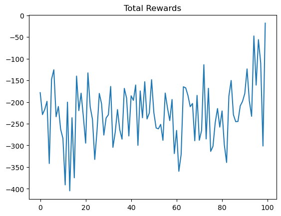
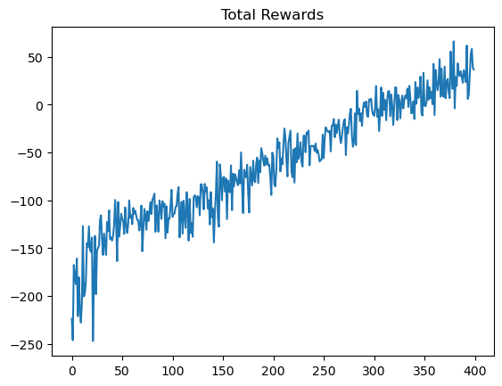
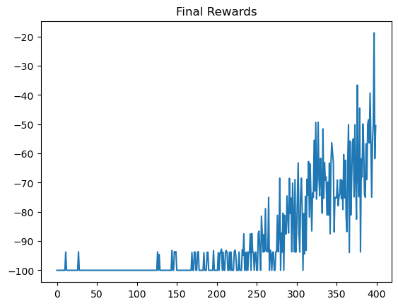

# HW12: RL

[hw12_v3.ipynb](assets/hw12_v3-20260115181709-ur54bak.ipynb)

[hw12_v4-actor-critic.ipynb](assets/hw12_v4-actor-critic-20260115181709-5i3ii4q.ipynb)

# 提交记录

- v0

  

  ​`print(np.mean(test_total_reward))`​ ->  **-116.8627533609837**
- v1：将奖励分数由讲义中的v0，改为Version 2（Discounted Cumulated Reward）

  ```python
  # compute discounted return for this episode
  gamma = 0.90
  G = 0
  returns = []

  for r in reversed(seq_rewards):
      G = r + gamma * G
      returns.insert(0, G)

  # append episode returns to batch rewards
  rewards.extend(returns)
  ```

  

   **-102.26353798747469**
- v2:换成Adam

  ```python
  self.optimizer = optim.Adam(self.network.parameters(), lr=1e-4)
  ```

  

  -223.89789215795435
- 增大训练次数与每轮episode

  ```python
  EPISODE_PER_BATCH = 16  # update the  agent every 5 episode
  NUM_BATCH = 300        # totally update the agent for 500 time
  ```

  ​`-309.4273846648039`

- v3:增加网络

  ```python
  class PolicyGradientNetwork(nn.Module):

      def __init__(self):
          super().__init__()
          self.fc1 = nn.Linear(8, 64)
          self.fc2 = nn.Linear(64, 64)
          self.fc3 = nn.Linear(64, 4)

      def forward(self, state):
          hid = torch.tanh(self.fc1(state))
          hid = torch.tanh(hid)
          return F.softmax(self.fc3(hid), dim=-1)

  self.optimizer = optim.Adam(self.network.parameters(), lr=1e-3)

  EPISODE_PER_BATCH = 16 
  NUM_BATCH = 500
  ```

  

  ​**​`92.10300306954132`​**
- v4: actor-critic

  实现了一个**共享表示的 Monte Carlo Advantage Actor–Critic 算法**：

  - 通过 Critic 提供的状态价值作为 baseline，显著降低策略梯度方差；
  - 通过批量 episode 的 Monte Carlo 回报与标准化处理，提高训练稳定性；
  - 从而在简单网络结构下实现高效、稳定的策略学习

  

  ​`-3.320031983387699`​

- v5:增大网络64-128，增加训练epoch 300->600

  

  ​`print(np.mean(test_total_reward))`

  - ​**​`288.87617704274015`​**
