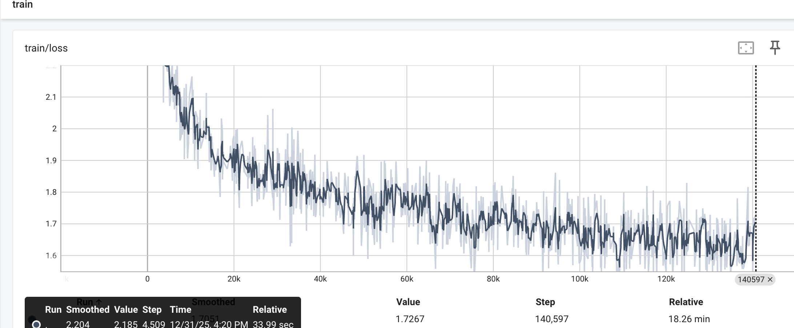
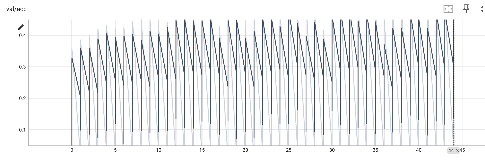
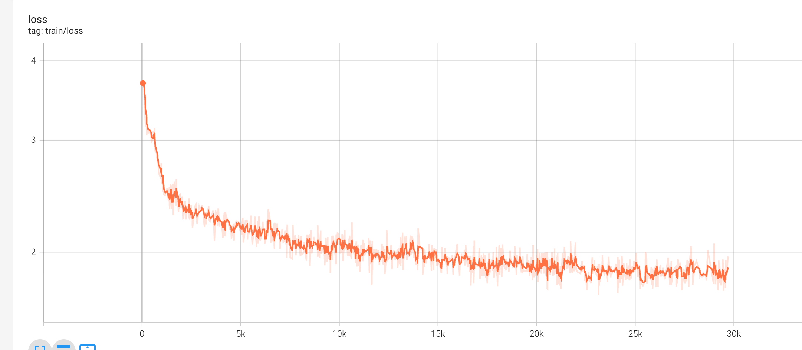
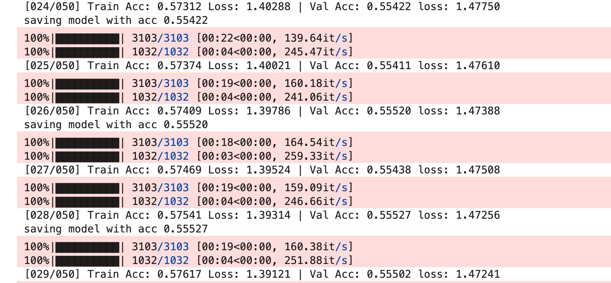
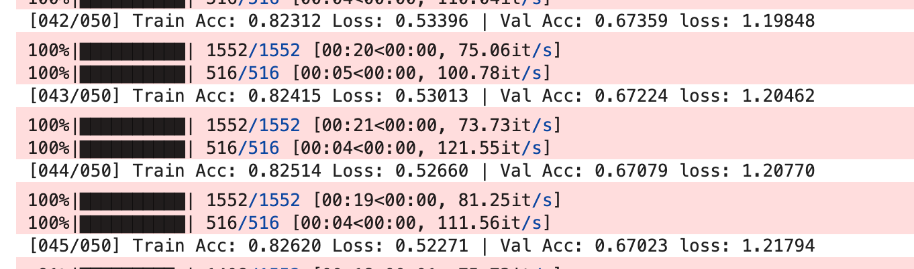
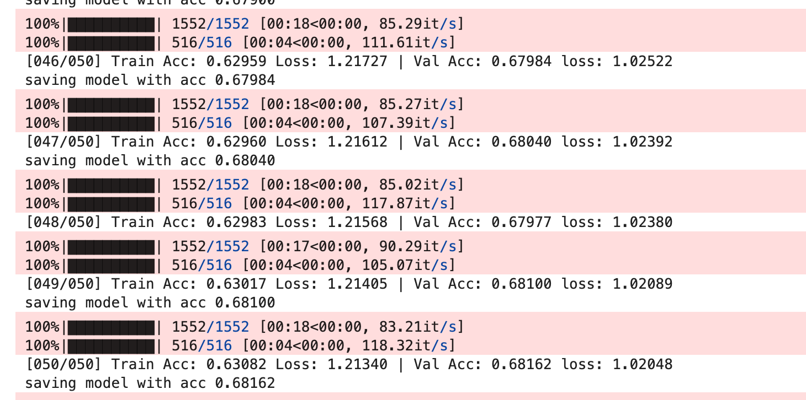
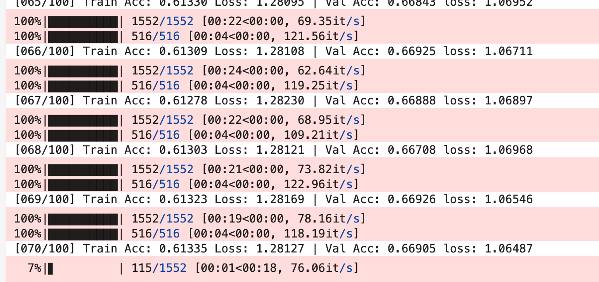
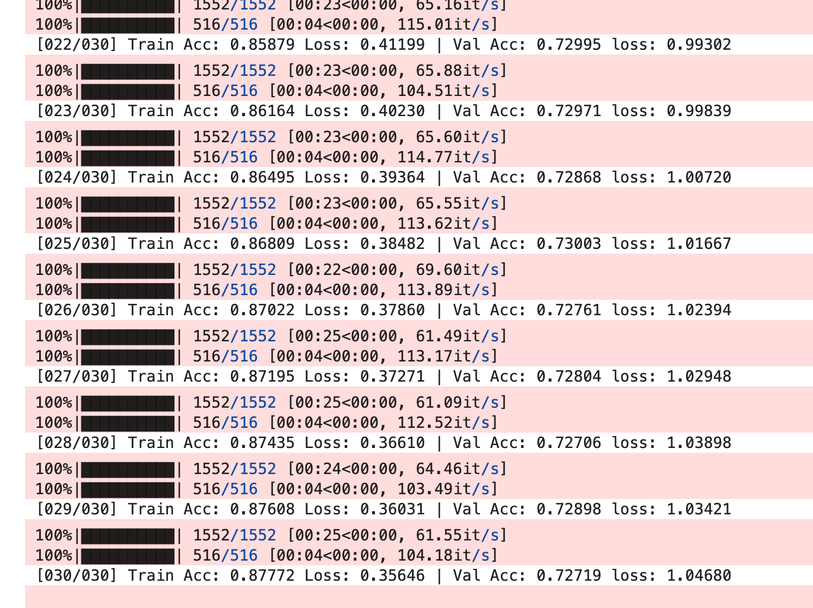

# HW2: Classification

# 代码

[hw2.ipynb](assets/hw2-20260101212641-iwg1t1e.ipynb)

# 调参过程

- sample code

  

- v1: 增加num_epoch: 10 -> 100；增加hidden_layers: 2 -> 10

  正确率没有什么变化，提前终止

  

  
- v2: 增加hidden_dim: 64 -> 128；hidden_layers：10->16

  

  

- v3: 增加hidden_dim:128-512

  训练到30终止

  

- v4:增加BN

  模型太复杂，训练集表现好，但是测试集效果很差，**过拟合了**

  

  
- v5:模型简化：hidden_dim:512-256，hidden_layer:16->8

  

  还是**过拟合**

  
- v6简化模型：hidden_layer:hidden_dim:256-128，hidden_layer:8->4

  

  不过拟合了，但是模型的能力也不行了...

  
- V7：hidden_layer:hidden_dim:128->512；concat_nframes：3 -> 11

  过拟合的问题

  

  

‍

- v8:V7：hidden_layer:hidden_dim:128->256；concat_nframes：11 -> 21

  还是过拟合

  

  
- v9:防止过拟合

  增加：`nn.Dropout(0.3)`：30%的神经元的输出直接为0

  L2 正则（weight decay）`optimizer = torch.optim.Adam(     model.parameters(),     lr=learning_rate,     weight_decay=1e-4 )`

  

  

  看上去还可以增加训练次数，并且loss降的有点慢，可以调高一点
- v10：LR = 1e-3, num_epochs = 100

  

  感觉就是模型能力达到极限了，下次把丢弃的神经元比例调低一下

  
- v11：`nn.Dropout(0.3)`​ -> `nn.Dropout(0.2)`

  

  还是模型能力的问题，并且epoch设置太高了前面就能看出来这个问题

  

- v12：`nn.Dropout(0.2)`​ -> `nn.Dropout(0.1)` num_epoch 100->50

  

  
- v13: hidden_dim:256->1024

  

- v14:hidden_dim:1024->2048

  

  
- v15:增加层数：hidden_layers:4->6

  

  

- v16:

  - lr:1e-3 -> 2e-4
  - 使用`CosineAnnealingWarmRestarts`

  

- v17

  - ​`Relu`​ -> `LeakyReLU`

  

  效果大提升，但是有过拟合问题

  
- v18

  - ​`nn.Dropout(0.2)`​ -> `nn.Dropout(0.3)`

  

- v19

  - 训练集占比:0.75->0.8

  - 模型层数:4 hidden_dim=1024

  

  
- v20

  - num_epochs: 20 -> 100

  

‍
