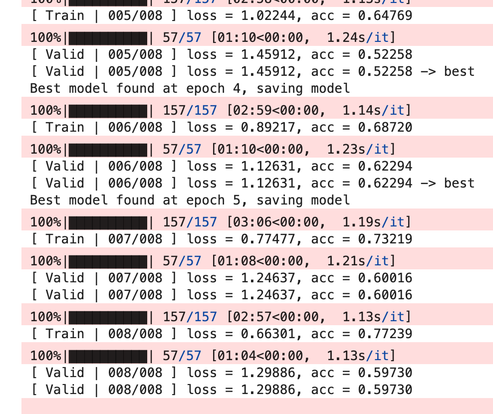
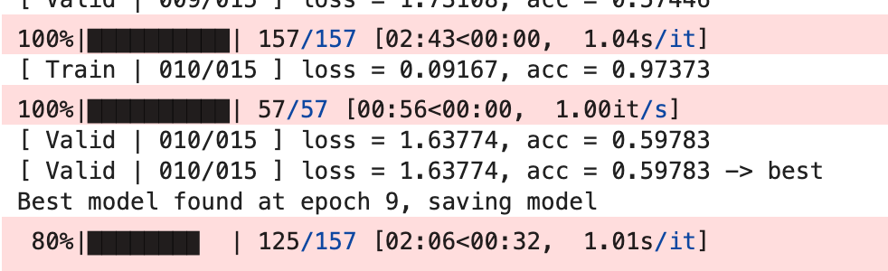
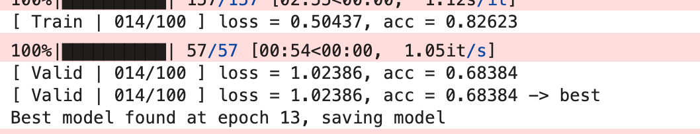

# HW3: CNN

[hw3.ipynb](assets/hw3-20260103202908-xhlu19h.ipynb)

- v0

  

  

- v1

  - 去掉最后一层的池化，保留更多的信息
  - 在线性网络中也做一下BN
  - 增加训练的epoch数
  - 代码

    ```python
    class Classifier(nn.Module):
        def __init__(self):
            super(Classifier, self).__init__()
            # torch.nn.Conv2d(in_channels, out_channels, kernel_size, stride, padding)
            # torch.nn.MaxPool2d(kernel_size, stride, padding)
            # input 維度 [3, 128, 128]
            self.cnn = nn.Sequential(
                nn.Conv2d(3, 64, 3, 1, 1),  # [64, 128, 128]
                nn.BatchNorm2d(64),
                nn.ReLU(),
                nn.MaxPool2d(2, 2, 0),      # [64, 64, 64]

                nn.Conv2d(64, 128, 3, 1, 1), # [128, 64, 64]
                nn.BatchNorm2d(128),
                nn.ReLU(),
                nn.MaxPool2d(2, 2, 0),      # [128, 32, 32]

                nn.Conv2d(128, 256, 3, 1, 1), # [256, 32, 32]
                nn.BatchNorm2d(256),
                nn.ReLU(),
                nn.MaxPool2d(2, 2, 0),      # [256, 16, 16]

                nn.Conv2d(256, 512, 3, 1, 1), # [512, 16, 16]
                nn.BatchNorm2d(512),
                nn.ReLU(),
                nn.MaxPool2d(2, 2, 0),       # [512, 8, 8]

                nn.Conv2d(512, 512, 3, 1, 1), # [512, 8, 8]
                nn.BatchNorm2d(512),
                nn.ReLU(),
            )
            self.fc = nn.Sequential(
                nn.Linear(512*8*8, 1024),
                nn.BatchNorm1d(1024),
                nn.ReLU(),
                nn.Linear(1024, 512),
                nn.BatchNorm1d(512),
                nn.ReLU(),
                nn.Linear(512, 11)
            )

        def forward(self, x):
            out = self.cnn(x)
            out = out.view(out.size()[0], -1)
            return self.fc(out)
    ```

  

  严重的过拟合

  

- v2：考虑降维了，因为上来给FNN的参数量是512*8*8，实在太大了

  CNN最后输出改为512x2x2

  ```python
              nn.Conv2d(512, 512, 3, 1, 1), # [512, 8, 8]
              nn.BatchNorm2d(512),
              nn.ReLU(),
              nn.AdaptiveAvgPool2d((2, 2)) # [512, 2, 2]
  ```

  

  

- v3

  继续降维

  CNN最后输出改为512x1x

  

  

  结果还是过拟合，但是效果也差了，也许需要修改CNN的结构

- v4

  改成v2的结构，然后pool改为看平均而不是max

  效果也一般

  

  

- v5：做数据增强

  __ **getitem __ 方法中有**​`transforms.Compose` 所以图片每次获取都不一样

  ```python
  # Normally, We don't need augmentations in testing and validation.
  # All we need here is to resize the PIL image and transform it into Tensor.
  test_tfm = transforms.Compose([
      transforms.Resize((128, 128)),
      transforms.ToTensor(),
  ])

  # However, it is also possible to use augmentation in the testing phase.
  # You may use train_tfm to produce a variety of images and then test using ensemble methods
  train_tfm = transforms.Compose([
      transforms.RandomResizedCrop(128, scale=(0.8, 1.0)),
      transforms.RandomHorizontalFlip(p=0.5),
      transforms.RandomRotation(15),
      transforms.ColorJitter(0.2, 0.2, 0.2),
      transforms.ToTensor(),
      transforms.RandomErasing(p=0.25, scale=(0.02, 0.2)),
  ])
  ```

  

  感觉非常依赖于图片转化后学到的别的特征，增加下epoch碰碰运气

  

- v6:增加epoch=100

  增强更加随机

  ```python
  train_tfm = transforms.Compose([
      transforms.RandomChoice([
          # 弱增强（保留语义）
          transforms.Compose([
              transforms.Resize((128, 128)),
              transforms.RandomHorizontalFlip(0.5),
          ]),

          # 强增强（破坏捷径）
          transforms.Compose([
              transforms.RandomResizedCrop(128, scale=(0.7, 1.0)),
              transforms.RandomRotation(15),
              transforms.ColorJitter(0.2, 0.2, 0.2),
          ]),
      ], p=[0.4, 0.6]),

      transforms.ToTensor(),

      transforms.RandomErasing(
          p=0.25,
          scale=(0.02, 0.15),
          ratio=(0.3, 3.3)
      ),
  ])
  ```

  

  

  还是有过拟合的问题

- v8：尝试解决过拟合

  ```python
          self.fc = nn.Sequential(
              nn.Dropout(0.3),
              nn.Linear(512*4*4, 1024),
              nn.BatchNorm1d(1024),
              nn.ReLU(),
              nn.Dropout(0.3),
              nn.Linear(1024, 512),
              nn.BatchNorm1d(512),
              nn.ReLU(),
              nn.Dropout(0.3),
              nn.Linear(512, 11)
          )
  ```

  

  

‍
