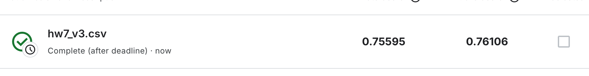

# HW7: BERT

[hw7_final.ipynb](assets/hw7_final-20260106104059-72tb55k.ipynb)

# 提交记录

- **v0：sample_code**

  
- **v1:增加**​**​`epoch`​**​ **:1 -> 5 ，减少**​**​`doc_stride`​**​  **：128->32**

  
- **v2：优化学习率、训练集答案设置随机位置**

   

  - 学习率LR实现Linear decay
  - 调整训练集中答案出现位置为随机（之前一直是中间）

  ```python
  # LR
  from transformers import get_linear_schedule_with_warmup

  num_training_steps = num_epoch * len(train_loader)
  num_warmup_steps = int(0.1 * num_training_steps)

  scheduler = get_linear_schedule_with_warmup(
      optimizer,
      num_warmup_steps=num_warmup_steps,
      num_training_steps=num_training_steps
  )

  optimizer.step()
  scheduler.step()
  optimizer.zero_grad()
  ```

  ```python
  A_s = answer_start_token
  A_e = answer_end_token
  W = self.max_paragraph_len
  L = len(tokenized_paragraph)

  low = max(0, A_e - W + 1)
  high = min(A_s, L - W)

  if low > high:
      paragraph_start = low  # 极端情况兜底
  else:
      paragraph_start = random.randint(low, high)

  paragraph_end = paragraph_start + W

  ```

- **v3: 优化**​**​`evaluate`​**​  **：Top-k span-level evaluate**

  

  原始版本中，直接遍历所有窗口找到max(st_prob + ed_prob)，也没考虑有可能st > ed

  - 改进思路

    在每个 window 内：

    - 枚举合法的 `(start, end)`
    - 约束：

      - ​`start ≤ end`
      - ​`end - start ≤ max_answer_len`
    - 用 `start_logit + end_logit` 给 span 打分
    - 在 **所有 window 的所有 span** 里选全局最优

    ```python
    def evaluate(data, output, max_answer_len=30, top_k=5):
        """
        data:
            data[0]: input_ids, shape = (1, num_windows, seq_len)
        output:
            output.start_logits: (num_windows, seq_len)
            output.end_logits:   (num_windows, seq_len)
        """

        best_score = float('-inf')
        best_answer = ""

        num_windows = data[0].shape[1]

        for k in range(num_windows):
            start_logits = output.start_logits[k]   # (seq_len,)
            end_logits   = output.end_logits[k]     # (seq_len,)
            input_ids    = data[0][0][k]             # (seq_len,)

            # 取 start / end 的 top-k
            start_scores, start_indices = torch.topk(start_logits, top_k)
            end_scores, end_indices     = torch.topk(end_logits, top_k)

            # 枚举 top-k × top-k 的 span
            for i, s_idx in enumerate(start_indices):
                for j, e_idx in enumerate(end_indices):
                    # 合法性约束
                    if e_idx < s_idx:
                        continue
                    if e_idx - s_idx + 1 > max_answer_len:
                        continue

                    score = start_scores[i] + end_scores[j]

                    if score > best_score:
                        best_score = score
                        best_answer = tokenizer.decode(
                            input_ids[s_idx : e_idx + 1],
                            skip_special_tokens=True
                        )

        return best_answer.replace(" ", "")
    ```

- **v4: 增加epoch：5 -> 15**

  

‍
