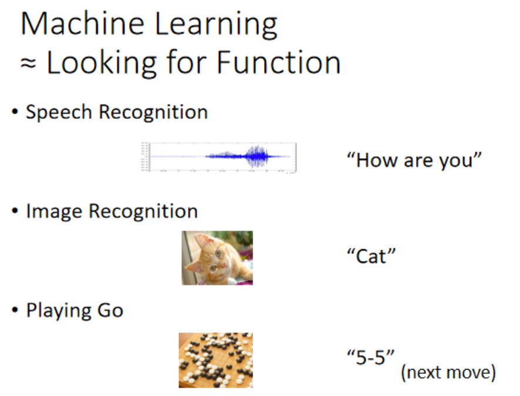
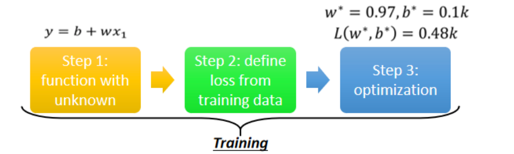
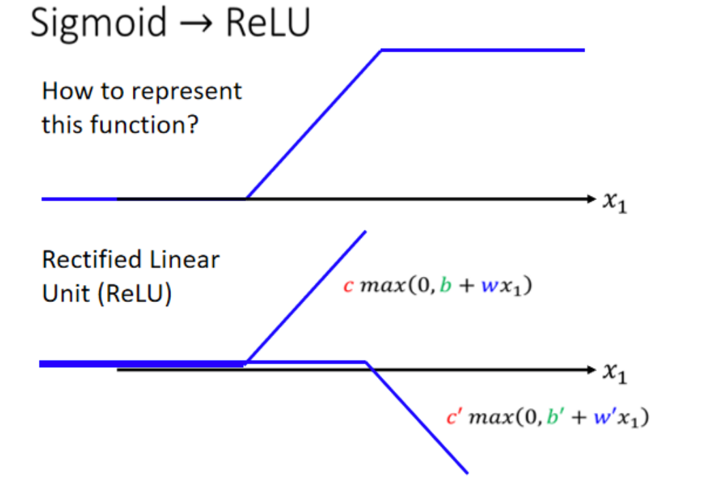

# Regression

# 1. Machine Learning

- **机器学习就是让机器具备找函数的能力**

  

# 2. Case Study：Regression

- 机器学习找函数的过程可以分为**三个步骤**

  - **Function with Unknown Parameters**
  - **Define Loss from Training Data**
  - **Optimization**

    

## 2.1 Linear Model

## 2. 2 Piecewise Linear Curves

> **Linear Model 太过于简单，x与y的关系往往不是一条直线，如何拟合复杂的曲线呢？**
>
> 答案：可以用若干“Z字形”曲线来拟合，图中的红线就可以用蓝色的0、1、2、3相加得到。完全弯曲的曲线也可以通过选取点来拟合。

- 哪个函数可以代表这个“蓝色Z字形函数”呢？

  **Sigmoid Function:**

  $$
  y = \frac{c}{1 + e^{-(wx_1 + b)}}
  $$

  

  

**多个 Sigmoid 叠加后的函数（逼近任意连续函数）：** 

$$
y = b + \sum_i c_i \cdot \sigma(w_i x_1 + b_i)
$$

## 2.3 New Model

### 2.3.1 More Feature Model

- 多个属性

  $$
  y = b + \sum_i c_i \, \sigma\!\left( b_i + \sum_j w_{ij} x_j \right)
  $$

- 矩阵向量形式：

  $$
  \begin{aligned}
  (1)\;& r_i = \sum_j w_{ij} x_j + b_i \\[6pt]

  (2)\;& a_i = \sigma(r_i) \\[6pt]

  (3)\;& y = b + \sum_i c_i a_i \\
      & y = b + \sum_i c_i \, \sigma\!\left( b_i + \sum_j w_{ij} x_j \right) \\[10pt]

  (4)\;& x =
  \begin{bmatrix}
  x_1 \\ x_2 \\ \vdots \\ x_J
  \end{bmatrix},
  \quad
  W =
  \begin{bmatrix}
  w_{11} & w_{12} & \cdots & w_{1J} \\
  w_{21} & w_{22} & \cdots & w_{2J} \\
  \vdots & \vdots & \ddots & \vdots \\
  w_{I1} & w_{I2} & \cdots & w_{IJ}
  \end{bmatrix},
  \quad
  b =
  \begin{bmatrix}
  b_1 \\ b_2 \\ \vdots \\ b_I
  \end{bmatrix} \\[10pt]

  (5)\;& r = Wx + b \\[6pt]

  (6)\;& a = \sigma(r) \\[6pt]

  (7)\;& 
  c =
  \begin{bmatrix}
  c_1 \\ c_2 \\ \vdots \\ c_I
  \end{bmatrix},
  \quad
  y = c^\top a + b \\[10pt]

  (8)\;& y = c^\top \sigma(Wx + b) + b
  \end{aligned}
  $$

- 函数中的未知量

  

### 2.3.2 Back to ML_Step 2 :define loss from training data

### 2.3.3 Back to ML\_Step 3: Optimization

$$
\theta =
\begin{bmatrix}
\theta_1 \\
\theta_2 \\
\theta_3 \\
\vdots
\end{bmatrix}

\qquad
\theta^{*} = \arg\min_{\theta} L
$$

$$
g =
\begin{bmatrix}
\left. \dfrac{\partial L}{\partial \theta_1} \right|_{\theta=\theta^{0}} \\
\left. \dfrac{\partial L}{\partial \theta_2} \right|_{\theta=\theta^{0}} \\
\vdots
\end{bmatrix}
\qquad
g = \nabla L(\theta^{0})
$$

$$
\begin{bmatrix}
\theta_1^{1} \\
\theta_2^{1} \\
\vdots
\end{bmatrix}
\leftarrow
\begin{bmatrix}
\theta_1^{0} \\
\theta_2^{0} \\
\vdots
\end{bmatrix}
-
\begin{bmatrix}
\eta \left. \dfrac{\partial L}{\partial \theta_1} \right|_{\theta=\theta^{0}} \\
\eta \left. \dfrac{\partial L}{\partial \theta_2} \right|_{\theta=\theta^{0}} \\
\vdots
\end{bmatrix}
$$

### 2.3.4 模型变型

课程一开始说明：

- 我们使用 Sigmoid 是为了近似**蓝色的 Hard Sigmoid（Piecewise Linear）函数**
- 但 Sigmoid 是 S 型曲线，斜率平滑，不像 Hard Sigmoid 那样是**真正的折线**

**Sigmoid 逼近 Hard Sigmoid 没问题，但：**

- 计算量较大（exp 运算）
- 梯度在两侧容易变得非常小（梯度消失）

$$
ReLu = max(0, b + wx_i)
$$

$$
\text{HardSigmoid}(x)
=
\text{ReLU}(w_1 x + b_1)
-
\text{ReLU}(w_2 x + b_2)
$$

## 2.4 Deep learning

- 单层模型做的事情：

  $$
  a = \text{Activation}(Wx + b)
  $$

- **多层 = 把“同样的运算”重复做多次：**

  

  单层：

  $$
  x \rightarrow (W,b) \rightarrow \text{Activation} \rightarrow a
  $$

  如果再来一次（第二层）：

  $$
  a' = \text{Activation}(W' a + b')
  $$

  如果再来一次（第三层）：

  $$
  a'' = \text{Activation}(W'' a' + b'')
  $$

  于是形成链状结构：

  $$
  x \to a \to a' \to a'' \to \dots
  $$

  每一层都有自己独立的参数：

  - 不同的 $W, W', W''$
  - 不同的 $b, b', b''$
  - 要重复多少次（层数）是一个 **Hyperparameter（超参数）**

‍

# 3. Why deep learning？

> **根据所讲的内容，我们可以用很多激活函数来拟合目标曲线，那么用一层非常多的激活函数也可以做到，为什么要不断加层呢？（deep learning而不是fat learning）**
>
> （课程后续解答）

‍
