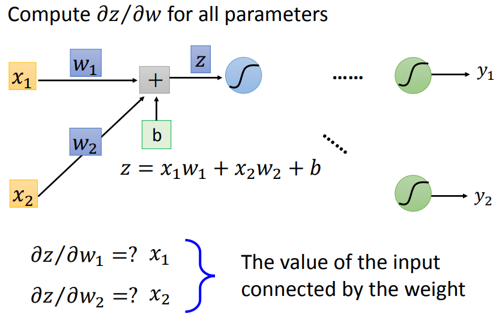
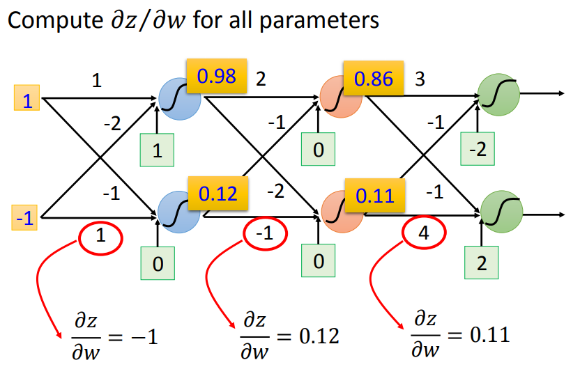
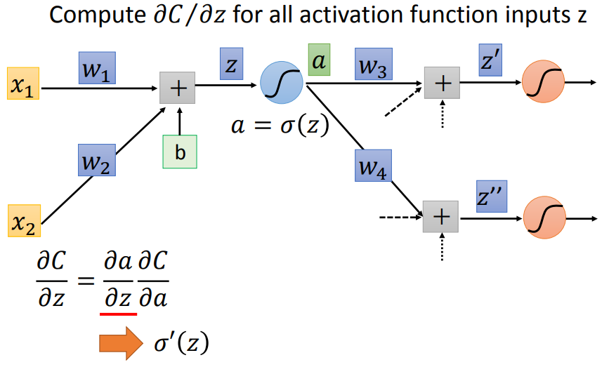
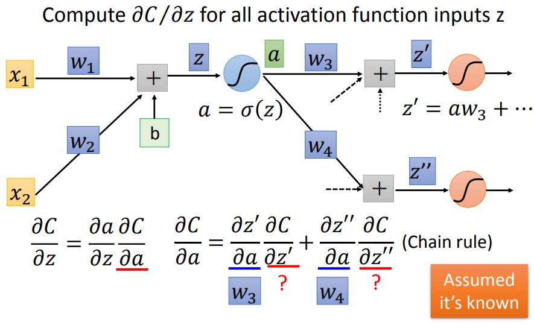
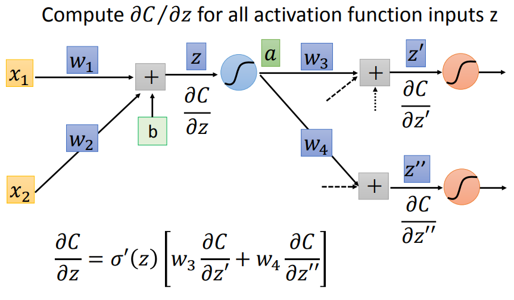
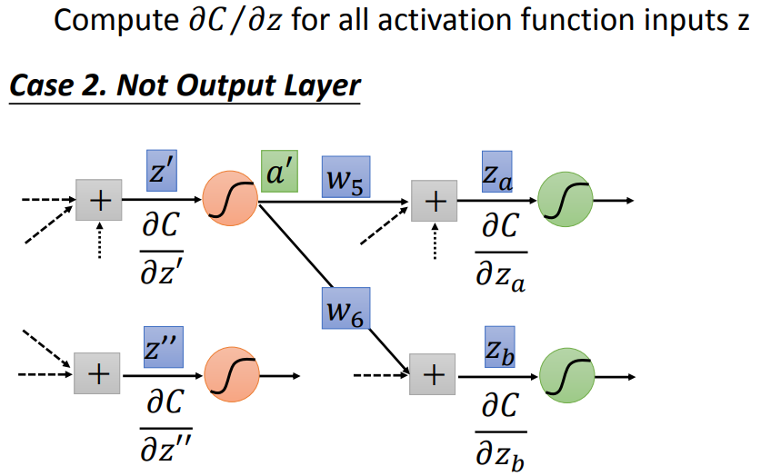

# Backpropagation

# 1. Gradient Descent & Chain Rule

在Neural Network用Gradient Descent的时候与在Logistic Regression、Liner Regression里使用是没有太多差别的，最大的差别是在Neural Network里有特别多的参数。

Backpropagation是一种Gradient Descent，是比较有效率的演算法，能更有效率的计算gradient。

# 2. Backpropagation

								

## 2.1 Backpropagation – Forward pass（计算$\frac{\partial z}{\partial w}$）

				​					​

想要计算出Neural Network中每一个**w对activation function input的偏微分**，只需要把input丢进去，计算每一个neural的output

## 2.2 Backpropagation –  pass（计算$\frac{\partial C}{\partial z}$）

					​					​

$\frac{\partial C}{\partial z} $可以拆分为$\frac{\partial a}{\partial z}  \frac{\partial C}{\partial a} $，而$\frac{\partial a}{\partial z} $就是求激活函数的偏微分（右图），可以很容易的求出，所以现在的问题就是如何求$\frac{\partial C}{\partial a} $  

								\

$\frac{\partial C}{\partial a} $根据链式法则可以拆分，损失 $C$ **不是直接由** **$a$** **决定的**，而是：$a \to z'$ ，$a \to z''$  

所以：$C = C(z'(a), z''(a))$  

$$
\boxed{
\frac{\partial C}{\partial a}
=
\frac{\partial C}{\partial z'}
\frac{\partial z'}{\partial a}
+
\frac{\partial C}{\partial z''}
\frac{\partial z''}{\partial a}
}
$$

$$
z'' = w_4 a + \dots
\quad\Rightarrow\quad
\frac{\partial z''}{\partial a} = w_4
$$

$$
z' = w_3 a + \dots
\quad\Rightarrow\quad
\frac{\partial z'}{\partial a} = w_3
$$

$$
\begin{aligned}
\frac{\partial C}{\partial z}
&=
\frac{\partial a}{\partial z}
\frac{\partial C}{\partial a}
\\[6pt]
&=
\frac{\partial a}{\partial z}
\left(
\frac{\partial C}{\partial z'} \frac{\partial z'}{\partial a}
+
\frac{\partial C}{\partial z''} \frac{\partial z''}{\partial a}
\right)
\\[6pt]
&=
\sigma'(z)
\left(
w_3 \frac{\partial C}{\partial z'}
+
w_4 \frac{\partial C}{\partial z''}
\right)
\end{aligned}
$$

所以，相较于最开始的神经网络，我们需要依靠后面层级的数据来计算$\frac{\partial C}{\partial a} $：

后续层级的情况有两种：最终输出层、不是最终输出层

								

- 若后续层级是最终输出层，则该层的梯度可以直接由损失函数对输出的导数得到。
- 若后续层级不是最终输出层，则该层的梯度需要由后续层级的梯度通过链式法则反向传递得到，因此反向传播为高效计算梯度提供了统一机制

  

## 2.3 Backpropagation – Summary

‍
