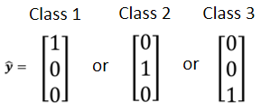
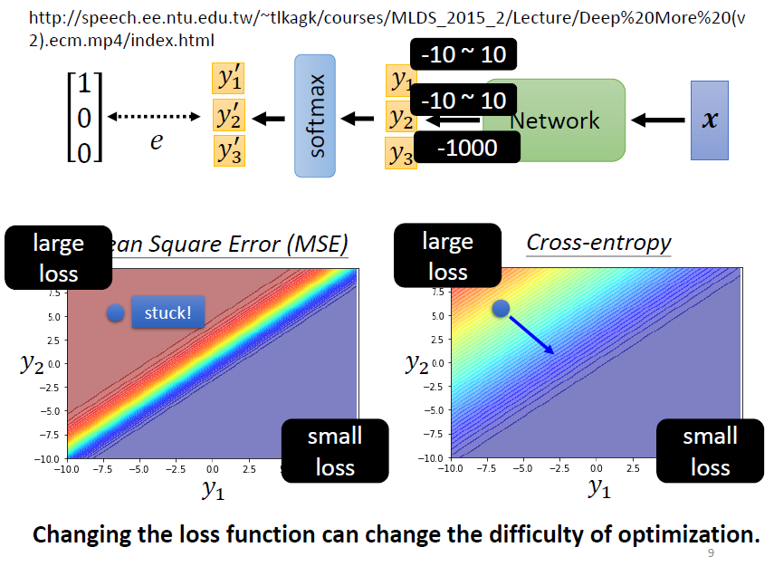

# Classification

参考资料:

[https://chsiang426.github.io/ML-2021-notes/02.3-DeepLearning-Los...](https://chsiang426.github.io/ML-2021-notes/02.3-DeepLearning-Loss%20of%20Classification/02.3-DeepLearning-Loss%20of%20Classification.html)

---

# 1. Classification as Regression

class 1 是编号1，class2是编号2，class 3是编号3，……。希望模型的输出y 可以跟class 的编号越接近越好

- **问题：3 个class 若分别设为1, 2, 3，背后隐含class 1 跟class 2 比较相关，class 1 跟class 3 比较不相关**

  - class 之间确实有相关性：假设根据身高体重预测是几年级的小学生，一​​年级真的跟二年级比较接近，一年级真的跟三年级比较没有关系
  - class 之间没有相关性：1, 2, 3 的假设可能**会造成模型失准**

# 2. Class as one-hot vector

写成向量形式，任两个class 的距离都相同：

好处：

- 不引入类别之间的顺序关系
- 任意两个类别之间的“距离”是一样的
- 适用于没有语义顺序的分类任务

产生多个数值：

## 2.1 Classification with softmax

当目标只有0 跟1，而y 有任何值，可**使用softmax(**​**$y'_i = \frac{\exp(y_i)}{\sum_j \exp(y_j)}$**​ **)，先把它normalize 到0 到1 之间**，这样才好跟label 计算相似度

经过计算后：

- 输出值变成0 到1 之间
- 输出值的和为 1
- 原本大的值跟小的值的**差距更大**

softmax 的输入，称作**Logit**

二分类问题使用Sigmoid 与Softmax 是等的

## 2.2 Loss of Classifacation

**优化目标：减小**yy**和**y′**之间的差距**e

不同的损失函数：MSE, Cross-entropy, …  
**选择cross-entropy，因为比MSE 更加适用于分类问题！**

从优化角度出发进行讨论，使用MSE 时，左上角的位置虽然Loss 很大，但梯度平坦，难以优化；而Cross-entropy 则更容易收敛⇒**改变Loss function，也会影响训练的过程**
