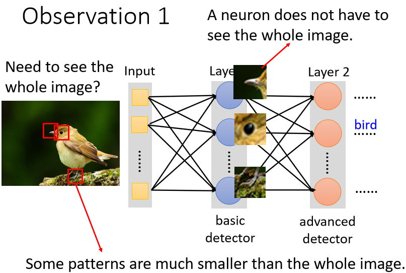
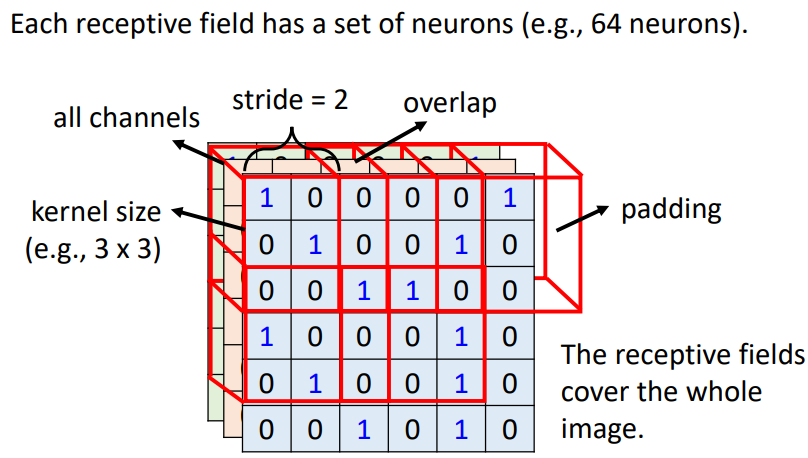
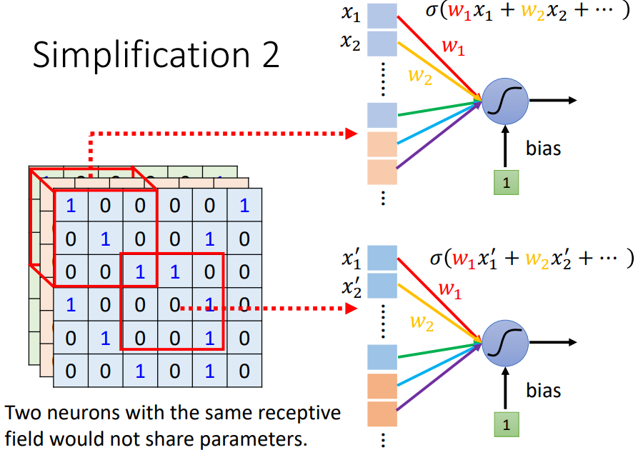
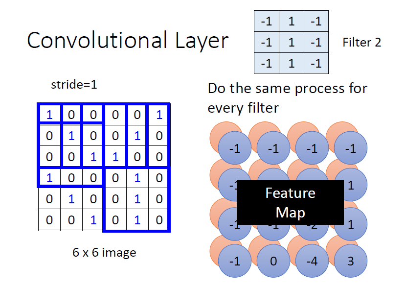
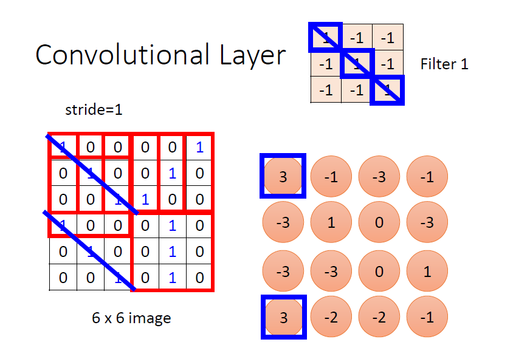
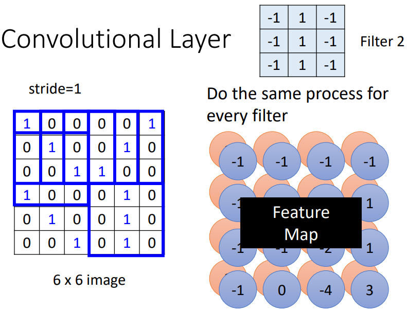
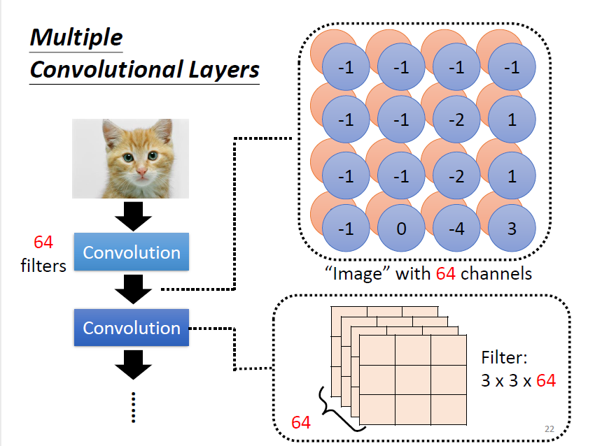
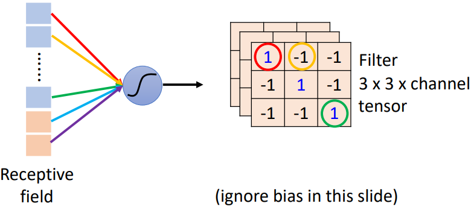
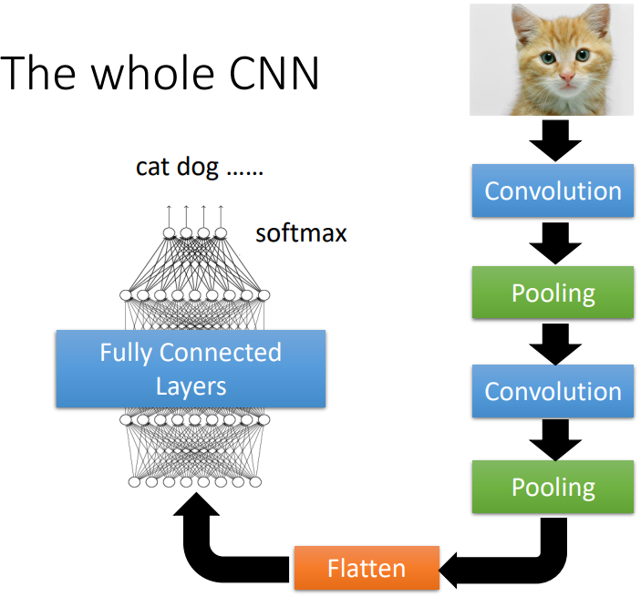

# CNN

# 1. 问题背景：影响分类怎么做

## 1.1 基本步骤

- 输入：固定大小影像（如 `100 × 100 × 3`）
- 输出：One-Hot 向量

  - 维度 \= 类别数
  - 通过 **Softmax + Cross Entropy**

影像在模型里是一个 ​**3D Tensor**：

$$
(\text{Height},\ \text{Width},\ \text{Channels})
$$

## 1.2 为什么不能直接用 Fully Connected Network（FC）


**参数量爆炸**

- 输入维度：`100 × 100 × 3 = 30,000`
- 若第一层有 1000 个 neuron：

$$
30{,}000 \times 1{,}000 = 3 \times 10^7 \text{ parameters}
$$

**问题**

- 参数太多
- 容易 overfitting
- 不利用影像结构特性

# 2. 神经元角度介绍CNN

## 2.1 Observation 1：局部性（Locality）



> **重要的视觉 Pattern 只需要看局部区域**

### Simplification 1：Receptive Field


**每个神经元只需要考察自己特定范围内的图像讯息，将图像内容展平后输入到神经元中即可**

- 每个 neuron 只看图像的一小块
- 不再看整张图

**注意：**

- receptive field 之间可以重叠
- 一个receptive field 可以有多个神经元守备
- receptive field 可以有大有小
- receptive field 可以只考虑某一些channel
- receptive field 可以是长方形
- receptive field 不一定要相连

### Receptive Field 的Typical Setting（In general）



1. 一般在做影像辨识的时会看全部的channel。所以在描述一个receptive field 的时候，无需说明其channel 数，只要讲它的​**高、宽⇒ kernel size→ 一般不做过大的kernal size，常常设定为3 × 3**
2. 每个receptive field 会有**不止一个神经元进行守备⇒ 输出通道数/卷积核数目**
3. 不同的receptive field 之间的关系⇒ ​**receptive field 的水平垂直位移：Stride**​【hyperparameter】  
    **→ 一般希望receptive field 之间有重叠，避免交界处的pattern 被忽略**
4. ​**receptive field 超出影响的范围⇒ padding**（补值：补0、补平均值、补边缘值、…）

## 2.2 Observation 2：平移不变性（Translation Invariance）

> **同一个 Pattern 会出现在图像不同位置**


### Simplification 2：Parameter Sharing（参数共享）



**两个不同receptive field 的neurons 有做一样的工作，就可以共用参数。尽管参数一样，但因为是不同的receptive field（不同的输入），所以输出也会是不一样的**

- 不同位置的 neuron **共享同一组参数**
- 这组共享参数叫做 **Filter（卷积核）**

### Parameter Sharing 的Typical Setting（In general）


# 3.  滤波器角度介绍CNN

> **Convolutional Layer**  **=**  **一组可学习的 Filter，在输入上滑动做局部加权求和，生成 Feature Map。**

## 3.1 卷积层基本定义



卷积层中有若干个filters，每个filter 可以“抓取”图片中的某一种pattern（pattern 的大小小于receptive field 大小）。**filter 的参数就是神经元中的“权值（weight）”**



**filter 的计算是“内积”：**  filter 跟图片对应位置的数值做矩阵乘法，乘完后再将元素相加

数学形式：

$$
y_{i,j} = \sum_{u,v,c} x_{i+u, j+v, c} \cdot w_{u,v,c} + b
$$



不同的filter 扫过一张图片，将会产生“新的图片”，**每个filter 将会产生图片中的一个channel ⇒ feature map**

## 3.2 多层卷积



第一层的卷积结果产生了一张4×4×64的feature map。继续卷积时，需要对64 个channel 都进行处理⇒ filter 的“高度”要是64

### 3.2.1 让小卷积核看到大pattern


在考虑第二层中3×3的范围，在原图实际上考虑了5×5范围的pattern。当卷积层越来越深时，即使只是3×3的filter，看到的范围实际上是会越来越大

## 3.3 卷积层的完整张量形状变化

### 输入

```text
(batch_size, C_in, H, W)
```

### Filter 参数

```text
(out_channels, C_in, kernel_h, kernel_w)
```

### 输出

```text
(batch_size, out_channels, H_out, W_out)
```

其中：

$$
\begin{aligned}
H_{\text{out}} &= \left\lfloor \frac{H + 2P_h - K_h}{S_h} \right\rfloor + 1 \\
W_{\text{out}} &= \left\lfloor \frac{W + 2P_w - K_w}{S_w} \right\rfloor + 1
\end{aligned}
$$

# 4. 神经元角度（Neuron）vs 滤波器角度（Filter）

神经元角度说到Neuron 会共用参数，这些共用的参数就是滤波器角度说到的Filter




### 4.1 不用看整张图片范围

- 神经元角度：只要守备receptive field
- 滤波器角度：使用Filter 侦测模式pattern

### 4.2 相同Pattern 可能出现在图片的不同位置

- 神经元角度：守备不同receptive field 的神经元可以共用参数
- 滤波器角度：Filter 扫过整张图片

# 5. Subsampling（Pooling）

举例而言，把偶数行拿掉，把奇数列拿掉，不会影响图片的辨析，同时可以**减少运算量**


### 5.1 不同Pooling 方法


# 6. The whole CNN（典型CNN 结构）

典型架构让**convolution 及pooling 交错运用**

**Convolutional Layer → Pooling → ...（循环）→ Flatten（把矩阵拉直排成向量） → FC → Softmax**



‍
