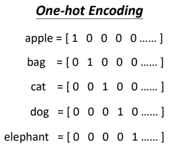
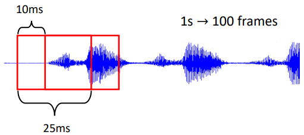
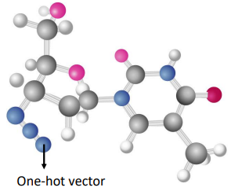
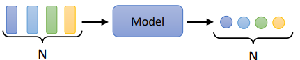
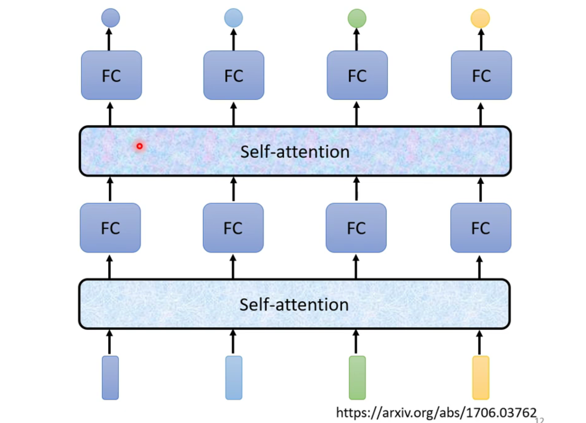
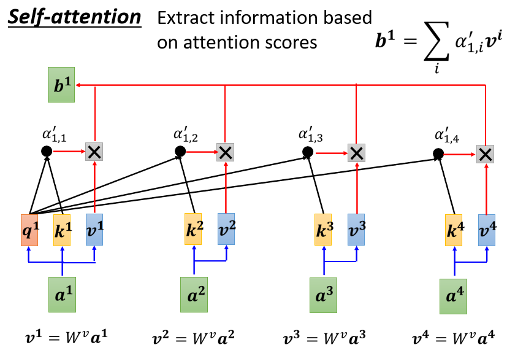
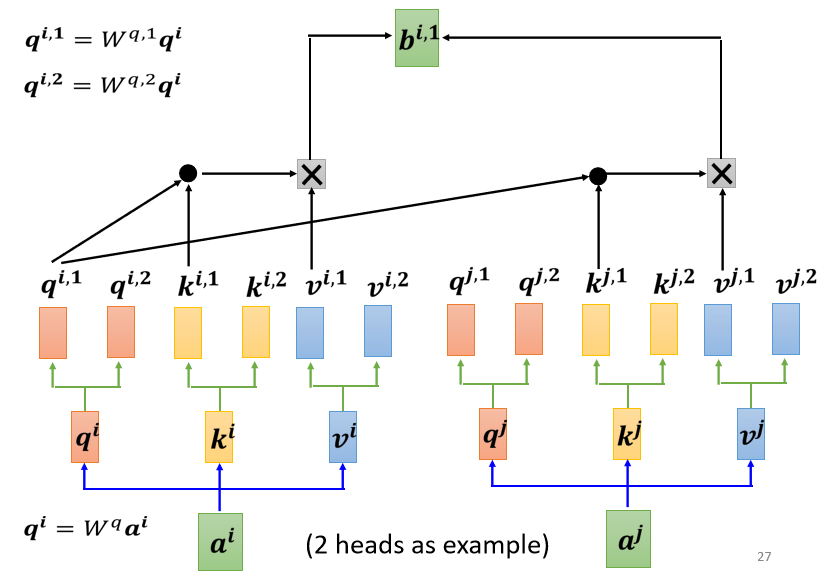
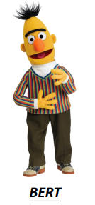
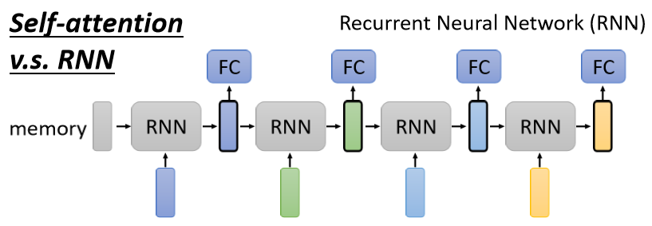
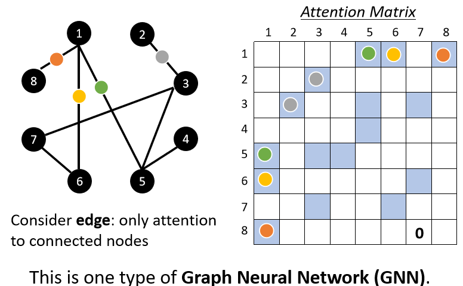

# Self-attention

# 1. 输入是向量序列的应用场景

## 1.1 文字处理（自然语言处理）

**将每一个词汇表示为向量**

                              					              

## 1.2 语音处理

会把一段声音信号取一个范围，这个范围叫做一个**窗口（window）** ，把该**窗口里面的讯息描述成一个向量，这个向量称为一帧（frame）** 。

## 1.3 图

**社交网络**是一个图，在社交网路上面每一个节点就是一个人。每一个节点可以看作是一个向量。每一个人的信息（性别、年龄及工作等等）都可以用一个向量来表示。因此一个社交网路可以看做是一堆的向量所组成

把一个**分子**当做是模型的输入，每一个分子可以看作是一个图，分子上面的每一个球就是一个原子，每个原子就是一个向量，而每个原子可以用独热向量来表示

					​            

‍

# 2. 输出的三种可能性

## 2.1 每个向量都有一个对应的标签

输入跟输出的长度是一样的

## 2.2 一组向量序列输出一个标签

整个序列只需要输出一个标签就好

## 2.3 模型自定决定输出多少标签

输入是N 个向量，输出可能是N′ 个标签，而N′ 是机器自己决定的。此种任务被称作**序列到序列（Sequence to Sequence，Seq2Seq）**

# 3. Self-attention 运作原理

## 3.1 以Sequence Labeling 为例

### 方法一：对每个向量用一个Full-connected network处理

**问题：**

有非常大的瑕疵，因为忽略了序列上下文的关系。同一个词汇在句子中不同的位置、不同的上下文环境下，词汇的词性有可能是不一样的，但**此方法的输出会因是同个词汇而永远只有同个输出**

### 方法二：若干组向量用一个Full-connected network处理

**问题：**

序列的长度有长有短，输入给模型的序列的长度，每次可能都不一样。开一个window 比最长的序列还要长，才可能把整个序列盖住。但是开一个大的窗口，意味着Fully-connected network 需要非常多的参数，可能运算量会很大，此外还容易过拟合

 **⇒ 想要更好地考虑整个输入序列的讯息，就要用到**​==**自注意力模型**==

## 3.2 Self-attention model

考虑整个序列的所有向量，**综合向量序列整体和单个向量个体**，得到对每一个向量处理后的向量，将这些向量个别连接一个FC，FC 可以专注于处理这一个位置的向量，得到对应结果；自注意力模型不是只能用一次，可以叠加很多次，与FC 可以交替使用

自注意力模型不是只能用一次，可以叠加很多次，与FC 可以交替使用

### 3.2.1 内部架构

**输入：** 一串的vector，这些vector 可能是整个network的input，也可能是某个hidden layer 的output

**输出：** 处理input 以后，**每一个b 都是考虑了所有的a 以后才生成出来的**

### 3.2.2 具体步骤（计算$b^1$为例）

1. 根据$a^1$向量找出跟其他向量的相关程度$\alpha$

2. 由一个计算attention的模组来得到$\alpha$。（q= query、kk= key）

- **Dot-product：**   
  把输入的两个向量分别乘上WqW和WkW，得到两个向量qq跟kk后做点积，把它们做逐元素（element-wise）的相乘， 再全部加起来得到一个α **（常用，也被用在Transformer 中）**

- **Addtive：**   
  两个向量通过Wq和Wk得到q和k后，把qq和k串起来丢到tanht anh函数（activation function），再乘上矩阵W得到α

‍

3. 计算完$a^1$跟其他向量的相关性αα后（也必须计算$a^1$跟自己的α），把所有的α经过softmax （也可使用其他激励函数，如： ReLu）得到α′

4. 把向量到$a^1$乘上Wv得到新的向量：v1、v2、v3和v4，接下来把每一个向量都去乘上α′后再求和得到$b^1$

### 3.2.3 矩阵的角度

1. 先计算q,k,v，合并后以Q,K,V表示

2. 根据$Q、K^T$计算A经过激活函数（softmax 或ReLu），得到A′（称做attention matrix）

3. V再乘以A得到b，以OO表示

**综合：**

- 每vector 以column 并起来称做I矩阵，I是Self-attention 的一组vector input
- 这些input 分别乘上Wq,Wk,Wv矩阵得到Q,K,V
- 接下来Q乘上$K^T$得到AA，再经过激活函数得到A称**Attention Matrix（生成**QQ**就是为了得到attention 的score）**
- A′再乘上V，就得到O。O就是Self-attention 这个layer 的输出
- Wq,Wk,Wv**是三个要学习的矩阵参数**

## 3.3 Multi-head Self-attention

Multi-head Self-attention 的使用非常广泛，有一些任务，如翻译、语音识别等，用该方法可以得到较好的结果。**需要多少的head 是需要调的hyperparameter**

在使用Self-attention计算相关性的时，是用q去找相关的k。但是 **”相关”有很多种不同的形式**，所以也许可以有多个qq，不同的q负责不同种类的相关性，这就是**Multi-head Self-attention**

**步骤：**

1. 先把a乘上一个矩阵得到qq
2. 再把q乘上另外两个矩阵，分别得到q1、q2，代表有两个head；同理可以得到k1,k2,v1

3. 从同一个head 里的k, q, v计算b

4. 将各个head计算得到的bb拼接，通过一个transform 得到bi然后再送到下一层

# 4. Positional Encoding

到目前为止，Self-attention 的操作里面没有位置的信息（天涯若比邻），**但有时候位置的信息很重要**。

举例，在做词性标注时，动词较不容易出现在句首，如果某一词汇是放在句首，其为动词的可能性就比较低，所以位置的讯息往往也是有用的

**方法：**

每个位置用一个vector$e^i$来表示它是sequence的第i个，然后加到原向量中

产生positional encoding vector 的方法有很多种，如人工设置、根据资料训练出来等，目前还不知道哪一种方法最好，仍是一个尚待研究的问题

# 5. 应用

## 5.1 自然语言处理

在自然语言处理领域，除了[Transformer](https://arxiv.org/abs/1706.03762)外，[BERT](https://arxiv.org/abs/1810.04805)也用到了Self-attention

										​      				       

## 5.2 语音

**问题：**

把一段声音讯号表示成一组向量的话，这组向量可能会非常地长；attention matrix 的计算覆杂度是长度的平方，因此需要很大的计算量、很大的存储空间

**解决方法：**

延伸Self-attention 的概念，运用​**Truncated Self-attention**​。使用Truncated Self-attention 只​**考虑一个小范围语音**，而不考虑一整个句子，如此就可以加快运算的速度

## 5.3 图像

一张图像可以看作是一个向量序列，既然也是一个向量序列，那么就也可以用Self-attention 来处理图像

### 5.3.1 Self-attention vs CNN

**Self-attention：**   
考虑一个像素和整张图片的讯息  
⇒ 自己学出receptive field 的形状和大小

**CNN：**   
 receptive field 是人为设定的，只考虑范围内的讯息

**结论：**

​**CNN 就是self-attention 的特例**​，可说是更flexible 的CNN，Self-attention 只要设定合适的参数，它可以做到跟CNN 一模一样的事情。根据[An Image is Worth 16x16 Words: Transformers for Image Recognition at Scale](https://arxiv.org/pdf/2010.11929.pdf)这篇paper 显示的结果，给出以下解释：

- Self-attention 弹性比较大，所以需要比较多的训练资料，训练资料少的时候会overfitting
- 而CNN 弹性比较小，在训练资料少时结果比较好，但训练资料多时，它没有办法从更多的训练资料得到好处

### 5.3.2 Self-attention vs RNN

Recurrent Neural Network 跟Self-attention 做的事情非常像，它们的input 都是一个vector sequence，前一个时间点的输出也会作为输入丢进RNN 产生新的向量，也同时会输入到FC。

很多的应用往往**都把RNN 的架构逐渐改成Self-attention 的架构**

**主要区别：**

- 对RNN 来说，假设最右边黄色的vector 要考虑最左边的输入，那它必须要把最左边的输入**存在memory 中都不能够忘掉**一路带到最右边，才能够在最后的时间点被考虑
- 对Self-attention 来说没有这个问题，它可以在整个sequence 上非常远的vector之间**轻易地抽取信息**

Self-attention 可以并行处理所有的输出，效率更高：

- Self-attention 四个vector 是并行产生的，不需等谁先运算完才把其他运算出来
- RNN 无法并行化，必须依次产生

## 5.4 图

Self-attention 也可以在图中使用，把node 当作vector。然而，图中的edge 意味着节点之间的关系，所以我们就可只计算有edge 相连的node 的attention，若两个node 之间没有edge，代表两个node 没有关系，就不必计算attention。这种方法也被称为**图神经网路（GNN）** 。

