# Transformer

# 1.  Seq2Seq 模型

Transformer 是一个序列到序列（Sequence-to-Sequence，Seq2Seq）的模型。序列到序列模型**输入和输出都是一个序列**，

输入与输出序列长度之间的关系有两种情况：一是**输入跟输出的长度一样**；二是**机器自行决定输出的长度**。

- **应用**

  - 语音识别

    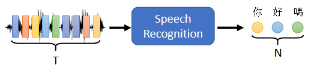
  - 机器翻译

    
  - 语音翻译

    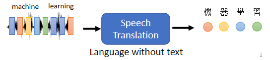
  - 语音合成

    
  - 聊天机器人

    
  - QA任务：翻译、自动摘要、情感分析

    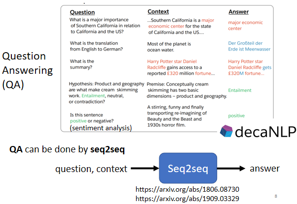
  - 文法剖析

    
  - 多标签（Multi-label）分类

    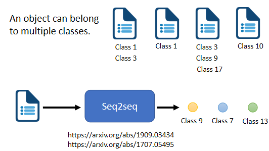

# 2. Transformer 架构

一般的Seq2Seq 模型会分成**encoder**和**decoder**，encoder 负责处理输入的序列，再把处理好的结果给decoder 决定要输出的序列

## 2.1 Encoder

编码器要做的事情就是给一排向量，输出另外一排向量。自注意力、循环神经网络（Recurrent Neural Network，RNN）、卷积神经网路都能输入一排向量，输出一排向量。

**Transformer 的编码器使用的是自注意力**，输入一排向量，输出另外一个同样长度的向量

### 2.1.1 内部剖析

Encoder 中会分成很多的block，每一个block 都是输入一排向量，输出一排向量。最后一个block 会输出最终的向量序列

Encoder 的每个block 并不是神经网络的一层，在每个block 中，输入一排向量后做Self-attention，考虑整个序列的信息，输出另外一排向量。

接下来这排向量会进到FC，输出另外一排向量，这一排向量就是一个block  的输出

### 2.1.2 Transformer的Encoder

Transformer 做的事情是更复杂的，因为Transformer 加入了**residual connection**和**layer normalization**的设计

**步骤：**

1. 考虑全部向量经由Self-attention 得到输出向量a，向量a加上其输入向量b得到新的输出，称为**residual connection**
2. 计算输入向量a+b的mean和standard deviation，做**layer normalization**
3. 得到的输出作为FC 的输入，FC输出结果和原输入做residual connection，再做一次layer normalization 得到的输出就是Transformer Encoder 中一个block 的一个输出向量

N 表示N 个block。首先在输入需要加上positional encoding。

 Multi-head attention 就属Self-attention的一种。

过后再做residual connection 和layer normalization，接下来还要经过FC，接着再做一次residual connection 和layer normalization。

如此是一个block 的输出，总共会重覆N 次

## 3.2 Decoder

### 3.2.1 Auto Regressive（AT）

以encoder 的向量为输入，并加上特殊的token 符号<BOS>（Begin Of Sequence）。在NLP 中，每一个token 都可以用一个one-hot vector 表示，其中一维是1，剩余都是 0

**步骤：**

1. 向decoder 输入encoder 产生的向量
2. 在decoder 可能产生的文字里面加上特殊token <BOS>
3. decoder 输出一个向量（长度与vocabulary size 一样），随后通过softmax，挑选分数最高的一个字作为最终的输出

> **v ocabulary size：取决于输出的单位。比如输出中文，则size 是中文方块字的数目**

4. 将3. 的输出作为decoder 新的输入
5. 重复步骤3. 和4.
6. 从vocabulary 中挑到<EOS> token，让decoder 停止

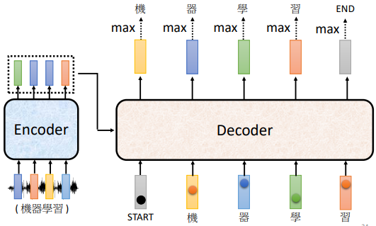

decoder 的输入是它在前一个时间点的输出，其会把自己的输出当做接下来的输入，因此当decoder 产生一个句子时，有可能看到错误的东西，造成**error propgation**

### 3.2.2 Transformer的decoder

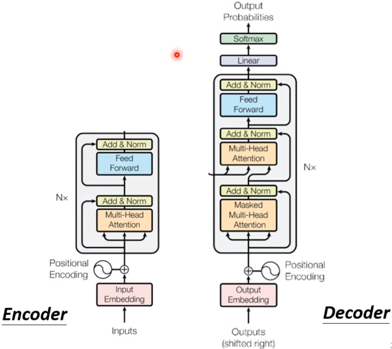

除了中间的部分，encoder 跟decoder，并没有什么差别。最后会再做一个softmax，使得它的输出变成一个概率分布。

最主要差别是decoder 的第一个self-attention 是使用**masked multi-head attention**

**Masked Multi-Head Attention：**

产生的​**输出并不考虑”右边“的部分**，原因是因为decoder 输出原理是顺次产生

### 3.2.3 non-autoregressive（NAT）

**问题：如何确定<BOS> 的个数？**

- **另外训练一个classifier，** 吃Encoder 的输入，输出一个数字，代表decoder 应该要输出的长度
- ​**给很多个<BOS> 的token**​，例如300 个 **<**  BOS  **>** 然后就会输出300 个字。**什么地方输出<EOS> 表示这个句子结束的点**

**NAT 的好处：**

- 并行化：  
  NAT 的decoder 不管句子的长度如何，都是一个步骤就产生出完整的句子，所以在速度上NAT 的decoder 比AT的decoder要快
- 容易控制输出长度：  
  例如语音合成有一个classifier 决定NAT 的decoder 应该输出的长度，并以此调整语音的速度。如果要让系统讲快一点，那就把classifier 的output 除以二，如此讲话速度就变两倍快

​**NAT 的decoder 的performance 往往都比AT 还差**​，原因：**[Multi-Modality](https://youtu.be/jvyKmU4OM3c)**

## 3.3 Encoder-Decoder 的CrossAttention

两个输入来自Encoder（Encoder 提供两个箭头）， Decoder 提供了一个箭头

**细节：**

1. encoder 输入一排向量，输出一排向量a1,a2,a3，产生k1,k2,k3及v1,v2,v3
2. decoder 输入<BOS> 经过self-attention（masked） 得到一个向量，乘上一个矩阵得到qq
3. 利用q,k计算attention 的分数，并做normalization，得到α1′,α2′,α3′
4. α1′,α2′,α3′与 v1,v2,v3做weighted sum 得到vv
5. 将vv输入至FC做接下来的任务

**总而言之，decoder 就是产生一个**q **，去encoder 抽取信息出来当做接下来decoder 的FC 的Input**

# 4. Transformer 训练过程

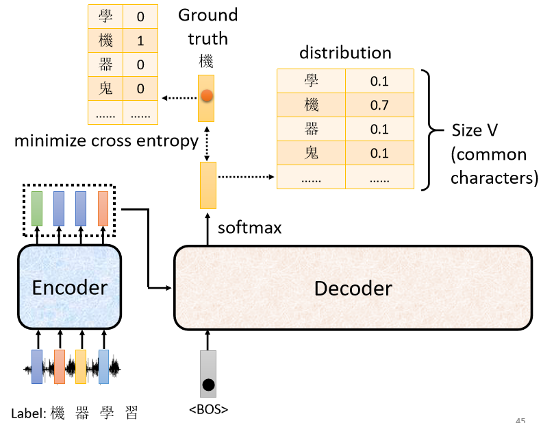

训练资料：一段音频与对应的文字，文字为one-hot encoding 的向量

训练过程：decoder 输出的是概率分布，可以通过输出的概率分布与ground truth 之间的计算cross entropy 并求梯度实现优化，使cross entropy 的值越小越好

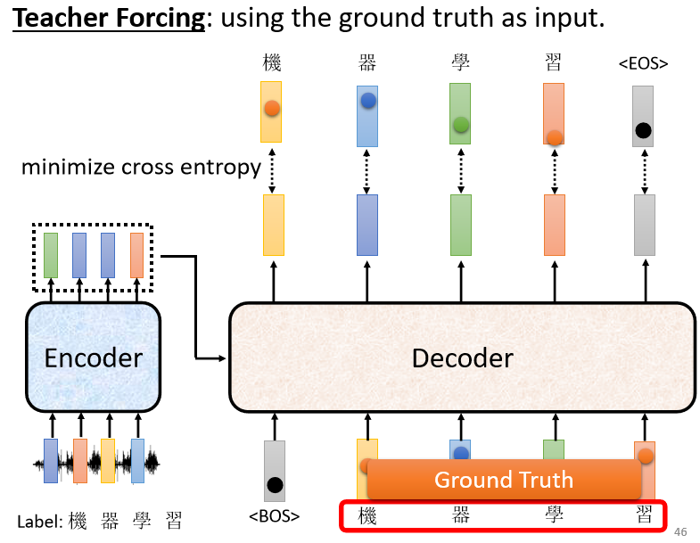

**注意：**

在训练decoder 时，输入的是​**正确答案**​（ground truth）而不是自己产生的答案，称作**Teacher Forcing**

# 5. Seq2Seq 模型训练技巧

### 5.1 Copy Mechanism

decoder 没有必要自己创造输出，它需要做的事情是从输入的资料中复制一些东西出来，而不是“创造词汇”

**举例：**

				​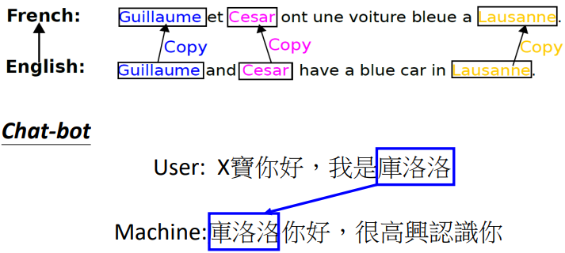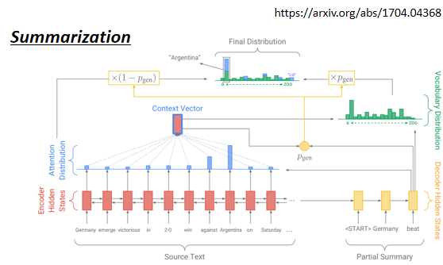

### 5.2 Guided Attention

**目的：**

强迫模型一定要把输入的每一个东西通通看过（如TTS），强迫attention 要有固定的方式

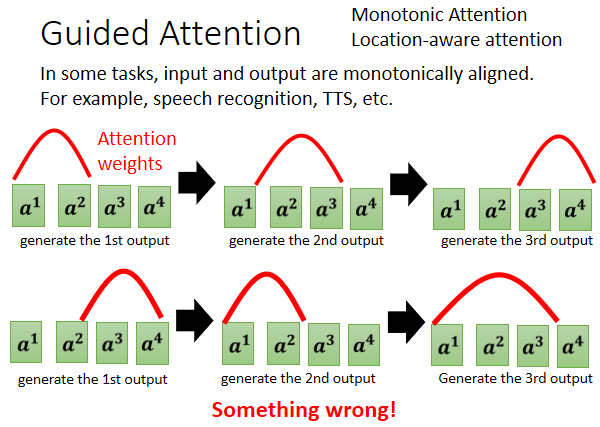

**动机：**

Seq2Seq Model 有时候Train 会产生莫名其妙的结果，比如漏字，例如：对语音合成或者是语音辨识来说，我们想像中的attention，应该要由左向右如上方的图，但有可能模型跳着看，就如上方的图

**更多资讯：Monotonic Attention、Location-aware Attention**

## 5.3 Beam Search

每次找分数最高的词元来当做输出的方法称为greedy decoding。红色路径就是通过greedy decoding 得到的路径。 但贪心搜索不一定是最好的方法，红色路径第一步好，绿色路径一开始比较差，但最终结果是绿色路径比较好

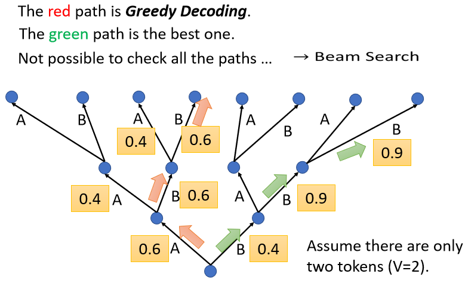

beam search 用比较有效的方法找一个估测的solution、一个不是完全精准的solution，这个方法有时候有用，有时候没有用，因为找出分数最高的路不见得比较好，取决于任务本身的特性

假设任务的答案非常明确，比如语音识别，说一句话，识别的结果就只有一个可能。对这种任务而言，通常beam search 就会比较有帮助；但如果**任务需要模型发挥一点创造力，beam search 可能比较没有帮助**

## 5.4 加入Noise

语音合成模型训练好以后，测试时要**加入一些noise。** 用正常的解码的方法产生出来的声音听不太出来是人声，产生出比较好的声音是需要一些随机性的，所以加入一些随机性的结果反而会比较好

## 5.5 Scheduled Sampling

测试时，decoder 看到的是自己的输出，因此它会看到一些错误的东西。但是在训练的时候，decoder 看到的是完全正确的，这种不一致的现象叫做**exposure bias**

							​		

**问题：**

因为decoder 从来没有看过错的东西，它看到错的东西会非常的惊奇，接下来它产生的结果可能都会错掉，导致一步错步步错

**解决：**

给decoder的输入加一些错误的东西，模型反而会学得更好⇒ **Scheduled Sampling**
