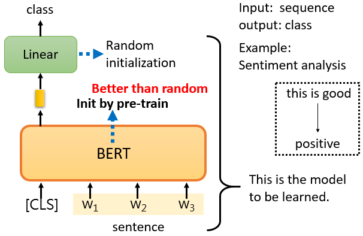
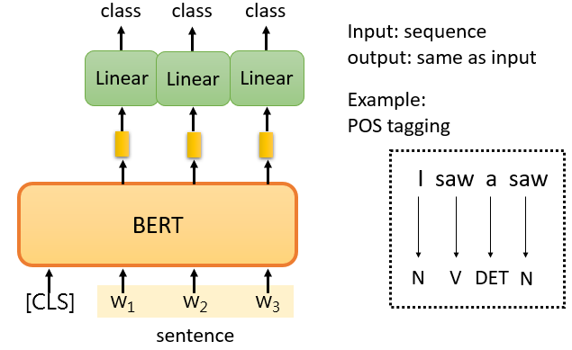
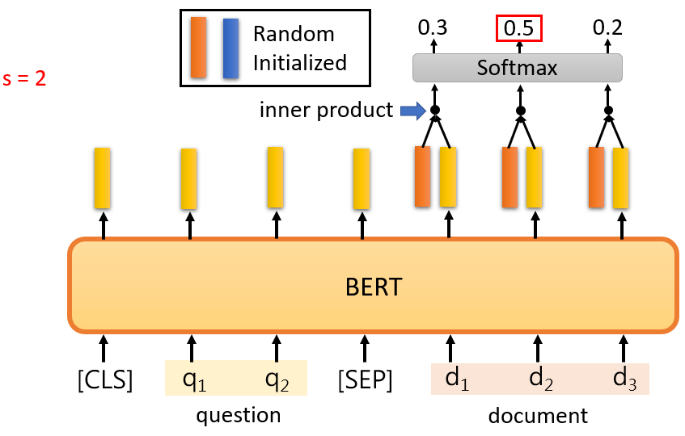

# Self-supervised Learning (BERT)

# 1. Self-supervised Learning

**self-supervised learning 属于unsupervised learning**的一种，其资料本身没有标签，但是训练过程中实际上有模型自己生成的标签

把训练资料分为两部分，一部分为**输入资料**、另一部分为**标注资料**

# 2. BERT

BERT 是一个**transformer 的encoder。**  BERT 可以输入一排向量，然后输出另一排向量，输出的长度与输入的长度相同。 BERT 一般用于​**自然语言处理**，它的输入是一串文本，也可以输入语音、图像等向量序列

训练BERT 有两个任务，分别是**Masking Input**及**Next Sentence Prediction**

## 2.1 Masking Input

**mask 的方法：**

- 方法一：用一个特殊的token “ **MASK” 盖住句子中的一个词**
- 方法二：**随机把某一个字换成另一个字**

两种方法​**都可以使用**​，使用哪种方法也是**随机决定的**

**训练方法：**

1. 向BERT 输入一个句子，先随机决定哪一部分的字将被mask
2. 输入一个序列，我们把BERT的相应输出看作是另一个序列
3. 在输入序列中寻找mask 部分的相应输出，将这个向量通过一个linear transform（矩阵相乘），并做softmax 得到一个分布
4. 用one-hot vector 表示被mask 的字符，并使输出和one-hot vector 之间的cross entropy 最小

**本质上就是在解决一个分类问题，BERT 要做的是预测什么字被盖住**

## 2.2 Next Sentence Prediction

在两个句子之间添加一个特殊标记 **[SEP]** ，代表两句子的分隔，如此BERT 就知道是两个不同的句子，此外还会在句子的开头添加另一个特殊标记 **[CLS]** 

​**只看[CLS] 的输出**，把它乘以一个linear transform，做一个二分类问题，输出yes/no，判断两句是否前后连续

**注意：**

论文​*[Robustly Optimized BERT Approach](https://arxiv.org/abs/1907.11692)*​（RoBERTa）指出Next Sentence Prediction 的方法几乎没有帮助，但还有另一种更有用的方法叫做​**Sentence Order Prediction**​，该方法选择两个句子本来就是连接在一起，但顺序可能颠倒或没有颠倒两种可能性，BERT 要回答是哪一种可能性。它被用于名为**ALBERT**的模型中，该模型是**BERT 的进阶版本**

## 2.3 BERT 的实际用途

BERT 可以用于其他任务，这些任务不一定与填空有关， 它可能是完全不同的东西，这些任务是真正使用BERT 的任务，其称为**downstream tasks**

- 预训练（Pre-train）：产生BERT 的过程
- 微调（Fine-tune）：利用一些特别的信息，使BERT 能够完成某种任务

透过预训练及微调让BERT能够完成各式各样的downstream tasks

### 2.3.1 Case 1：Sentiment analysis

给model 一个句子，把[CLS] 放在句子的前面，只关注[CLS] 的输出向量，对它进行linear transform + softmax，得到类别

针对情感分析任务作训练需要一些有标注的资料，训练的时候，linear transform 和BERT 模型都是利用gradient descent 来更新参数的

- linear transform 的参数是**随机初始化**的
- BERT 的初始化参数是pre-train 时学到的参数，此举**会有更好的性能**

### 2.3.3 Case 2 ：POS tagging

给model 一个句子，把[CLS] 放在句子的前面，关注每个字所对应的输出向量，对每一个向量进行linear transform + softmax，得到类别

### 2.3.4 Case 3：Natural Language Inference（NLI）

给出前提和假设，机器要做的是判断是否有可能从前提中推断出假设

给model 两个句子，把[CLS] 放在句子的前面，以[SEP] 隔开两个句子，只关注[CLS] 的输出向量，对它进行linear transform + softmax，得到类别

### 2.3.5 Case 4：Extraction-based Question Answering（QA）

Extraction-based QA 给模型一段文章，要模型回答跟文章相关的问题，保证答案一定在文章里面

给定文章和问题，输出两个整数s和e，代表文章中的第s到e个词汇是模型的答案

给model 两个句子，分别为question 和document，把[CLS] 放在question 的前面，以[SEP] 隔开两个句子，在这个QA 任务中，只有**两个向量需要随机初始化**，用**橘色向量**和**蓝色向量**来表示，这两个向量的长度与BERT 的输出相同

								​	

**方法：**

计算document 中的每一个词的输出与橘色向量的inner product 后，做softmax 取分数最高的词汇作为ss；同样在计算与蓝色向量的inner product 后，做softmax 取分数最高的词汇作为ee

## 2.4 BERT 训练难度高

数据量大、训练过程困难

# 3. Pre-training a seq2seq model

输入是一串句子，输出是一串句子，中间用**cross attention**连接起来，然后故意在encoder 的输入上做些干扰。

encoder 看到的是被干扰的结果，decoder 应该输出句子被破坏前的结果，训练这个模型实际上是预训练一个Seq2Seq 模型

**方法：**

把某些词遮住、删除一些词，打乱词的顺序，旋转词的顺序、遮住一些词再去掉一些词等等

- MASS：把某些词遮住
- BART：结合全部

# 4. 为什么BERT 有用？

## 4.1 Embedding

输入一串文字，每个文字都有对应的向量，称之为​**embedding**​。这些向量代表了**输入词的含义**

白话地说，把这些词所对应的向量画出来，或计算它们之间的​**距离**​，可以发现意思​**比较相似的词**​，它们的**向量比较接近**

训练BERT 时，输入w1、w2、w3和w4w，覆盖w2w2要BERT 预测w2，而它就是从上下文中提取讯息来预测w2。所以这个向量是其**上下文信息的精华**，可以用来预测w2是什么

BERT 输出的这些向量代表了该词的含义，可以认为BERT 在填空的过程中已经学会了每个汉字的意思

# 5. **Multi-lingual BERT**

使用多语言来进行预训练，比如中文、英文、德文、法文等等的填空题来训练BERT，称为**multi-lingual BERT**

Google 训练了一个multi-lingual BERT，做了104 种语言的填空题pre-train。神奇之处是如果用英文问答数据做fine-tune，但是测试中文问答，BERT 也可以表现得很好

## 5.1 **Cross-lingual Alignment**

一个简单的解释上述现象，也许对于multi-lingual 的BERT 来说，不同的语言并没有那么大的差异。无论用中文还是英文显示，对于**具有相同含义的单词，它们的embedding 都很接近**。中文的跳与英文的jump 接近，中文的鱼与英文的fish 接近，也许在学习过程中BERT 已经自动学会了

# 6. GPT

架构类似transformer encoder，用已知的词来预测接下来的词

‍
