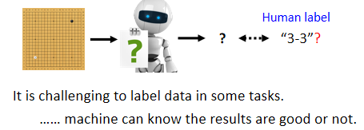
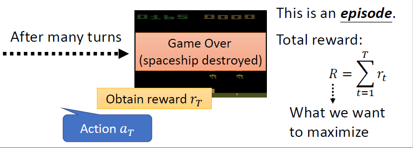
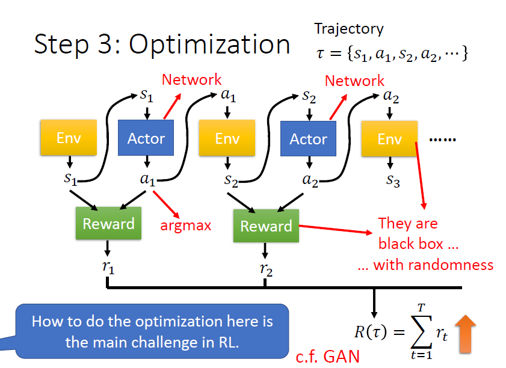
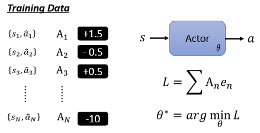
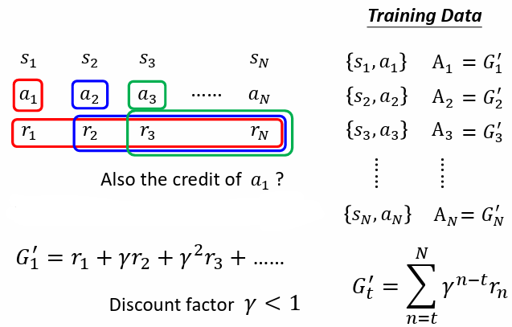
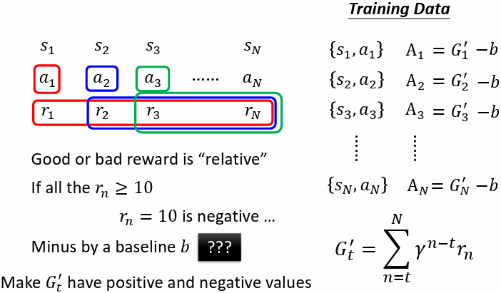
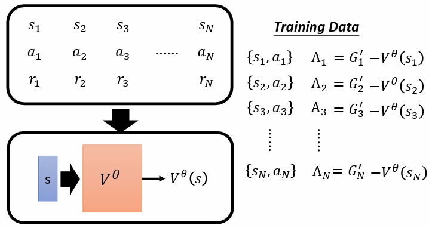
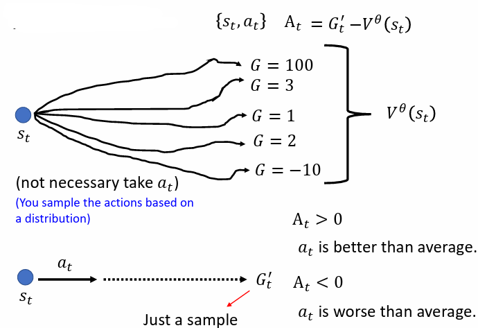
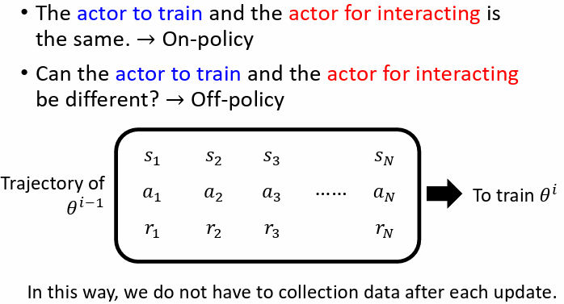

# Reinforcement Learning

# 1. 什么是RL？

**应用场景：**

- 给机器一个输入，但我们不知道最佳输出为何
- 收集有标注的资料有难度

例如叫机器学习下围棋，最好的下一步可能人类根本不知道。在不知道正确答案是什么的情况下，就可以使用RL

## 1.1 Actor

Reinforcement Learning 中有Actor及Environment，Actor 跟Environment 会进行互动。 A

ctor 就是RL中要找的function，输入为observation，输出为action，function 的目标是最大化从environment 得的reward总和

actor 以environment 提供的**observation 作为输入**，而actor 收到observation 后，会**输出action**影响environment，environment 受到action 的影响**产生新的observation，environment 会不断地给actor 一些reward**，告诉采取的action好不好

### Example 1：Space Invader

						​		​

- actor：摇杆操控者
- environment：游戏主机
- observation：游戏画面
- action：母舰向左、向右及开火
- reward：获得的分数

要找一个actor（function），可以使**得到的reward 的总和最大**

### Example 2：围棋

- actor ：AlphaGo
- environment：人类对手
- observation：棋盘
- action：在19×1919×19的棋盘上的落子
- reward：整局结束以后，赢得1 分，输得0 分。**过程中不会得到reward**

要找一个actor（function），可以**使得到的reward 的总和最大**

## 1.2 训练三步骤

### **Step 1：Function with Unknown**

actor 就是一个network，称为**Policy Network**

- 架构：FC、CNN、Transformer、……
- 输入：游戏的画面pixels
- 输出：每个可采取行为的分数（向左0.7 分、向右0.2 分、开火0.1 分，相加为1）

把**输出的分数当做概率，依照这些概率sample**出一个action

### **Step 2：Define “Loss”**

	         

一整局游戏称为一个​**episode**​，游戏中每个行为都可能得到reward，把​**所有的reward 相加得到整场游戏的total reward**​，又称为**return**

- **Reward：** 每个行为得到的反馈
- **Return：** 整场游戏得到的reward 之和，目标是最大化return，所以**loss 即为**−R

### **Step 3：Optimization**

对环境的observation s1，会变成actor的输入，actor 依此输出action a1，a1又作为环境的输入，根据a1输出s2，以此类推，直至满足游戏终止条件

ss跟aa所形成的sequence{ s1,a1,s2,a2,... } **称作Trajectory，以**ττ**表示**

定义**reward function 会考虑action 和observation 两者**，把所有的r相加得到RR，即是要去最大化的对象

**目标：**

找到actor 的一组参数，使得R(τ)越大越好

**问题：**

1. **actor 具有随机性：** 由于action 是sample 产生的，给定相同的s，产生的a可能不一样
2. **environment 和reward 是黑盒子：**  environment和reward 都不是network，也都**具有随机性**

总之，还是可以把RL看成三个阶段，只是在optimization时，如何最小化loss（最大化return）跟之前学到的方法是不太一样的

# 2. Optimization：Policy Gradient

## 2.1 如何控制Actor

- 若希望actor在看到某个s时**采取某一action**，只需将其**看做一般的分类问题**即可，为其设定ground truthaa，**loss** e**采用cross-entropy**
- 若希望actor在看到某个ss时**不采取某一action**，只需**将cross-entropy 乘一个负号**，最小化L等同于最大化e，以使actor的action离label更远

综合以上两种情况，可将L**定义为**e1−e2 **，找到一组参数最小化**e1 **，同时最大化**e2 **，即可最小化loss**L

## 2.2 收集训练资料

**方法：**

1. 为每个行为标注为”好”或”不好”（+1、-1）

1. 收集一堆某一observation 下应该采取或不采取某一action 的资料  
   定义loss：$L = +e1 -e2 + e3 - ... -eN$

2. 每个行为给定一个分数An

   

   系数不再是只有正负1  
   定义loss：L=∑An

**问题：**

- 如何定义$Ai$ (by Version 0 \~ Version 4)
- **如何产生**s**与**a**的pair**

## 2.3 **如何定义Ai**

|**版本**|**核心逻辑**|**优缺点分析**|
| --| ------------------------------| ------------------------------------------------------------------------------------|
|**V0**|动作后立刻拿到的 Reward|**太短视。** 比如下围棋，吃掉对方一颗子（即时奖励）可能导致满盘皆输。|
|**V1**|动作后后面所有 Reward 的总和|**考虑长远。** 但有个毛病：100步之前的动作和现在的得分可能没啥关系了。|
|**V2**|加上折扣因子$\gamma$|**逻辑更通顺。** 越远的奖励权重越低，就像“远水救不了近火”。|
|**V3**|减去一个基准值$b$|**防止盲目自信。** 如果所有动作都是正分，不减去平均值，机器就分不清哪个是“更好”，哪个是“普通好”。|
|**V4**|**Actor-Critic**(用预测减预测)|**最精准。** 用当前的实际表现$r_t + V(s_{t+1})$减去原本的预期$V(s_t)$。这叫​**Advantage（优势）** 。|

### Version 0 （不正确）

1. 首先定义一个随机的actor，**记录若干个episodes**中actor与环境互动时，面对每一个observationss产生的**action a**
2. 对记录下来的每个action 计算reward
3. 将reward作为A用于定义loss

**问题：**

- **短视近利**，没有长程规划的概念

  - 使用Version 0，只要采取向左跟向右，得到的reward 会是0；只有开火时得到的reward 是正的，导致机器会学到只有疯狂开火才是对的，会一直倾向于射击
- 每一个行为并不是独立的，每一个行为都会影响到接下来发生的事情
- **Reward Delay：需要牺牲短期的利益，以换取更长程的目标**

### Version 1（Cumulated Reward）

Version 1 中，at有多好，**不仅取决于**rt **，也取决于**at**之后所有的reward**，也就是把at当下及之后的所有action得到的reward 通通加起来，得到Gt **（cumulated reward）**

**问题：**

- 假设游戏非常长，把rN归功于a1也不合适

### Version 2（Discounted Cumulated Reward）

改良Version 1的问题，**新增discount factor**  γ **（** γ<1 **）** ，离at比较近的reward 给予较大的权重，较远的reward给予较小的权重，使较远的reward影响较小

### Version 3（标准化：-b）

假设某一游戏得到的reward永远都是正的，只是有大有小不同，因此每个G都会是正的，就算某些行为是不好的，还是会鼓励机器采取某些行为，所以**需要做标准化，改良Version 2，把所有**G′**减一个baseline** b

### Version 3.5（b = value funtion）

训练一个**critic**，给一个observationss，输出Vθ(s)，让Version3的b=Vθ(s)

**解释：**

- Vθ(st)可以视为在observation st下，actor采取各种可能的action后得到的Gt′**期望值**

- Gt′则是真正结束一个episode后，得到的discounted cumulated reward

- $At$是对actor 在observation st下，采取action at的评价：

  - 若At>0，表示Gt′>Vθ(st)，意义为采取特定action at得到的Gt′比随机选择一个action 的期望值Vθ(st)**好**，所以给予**正的评价**At
  - 若At<0，表示Gt′<Vθ(st)，意义为采取特定actionatat得到的Gt′比随机选择一个action 的期望值Vθ(st)**不好**，所以给予**负的评价**At

**问题：**

- At=Gt′−Vθ(st)表示用一次sample的结果减去所有的“平均”，似乎不够准确

### Version 4（Advantage Actor-Critic）

在observation $s_t$下，采取action $a_t$到$s_{t+1}$，考虑在$s_{t+1}$下采取各种action $a_{t+1}$的情况，并求所有$G_{t+1}'$的平均值（期望值）

因为**value function 意义上可以代表各种action 的平均discounted cumulated reward**

因此直接使用Vθ(st+1)表示$s_{t+1}$下各种$a_{t+1}$得到的$G_{t+1}'$的平均值（期望值），所以将$G_{t}'$替换为$r_t + V^{\theta}(S_{t+1})$  

⇒ $A_t = r_t + V^{\theta}(S_{t+1})$

## 2.4 训练过程

‍

1. 随机初始化actor，参数为θ
2. 迭代更新actor用参数为θi−1的actor 搜集资料，并以此资料计A，再计算loss L，做gradient descent 更新参数

每次**更新完一次参数以后，资料就要重新再收集一次**，此举非常花时间。而这么做的目的是因为带 θi − 1参数的actor收集到的资料，不一定适合拿来做为更新θi的资料

带θi参数的actor与带θi−1参数的actor采取的action不会一样，因而参考过去的trajectory没有意义

### 2.4.1 **On-policy vs Off-policy**

- **On-policy Learning：** 训练的actor 跟与环境互动的actor 是**同一个**
- **Off-policy Learning：** 训练的actor 跟与环境互动的actor 是**不同的，** 好处是不用一直收集资料，可以用一次收集到的资料，更新多次actor**Proximal Policy Optimization（PPO）** 即是采用off-policy learning

### 2.4.2 **Exploration（增加actor 做action 的随机性）**

**问题：**

- actor 所采取的action 是sample 而来的，因此**actor 采取的action 具有随机性，** 若一个actor 采取行为的随机性不够，则一个episode结束后，所搜集到的**资料中有些actions根本没有被sample到**，会**导致无从知道这些actions 的好坏**

**解决：**

期望跟环境互动的actor 采取actions 的随机性要够大，如此才能收集到比较丰富的资料因此在训练时，可由以下方式解决：

1. 刻意加大actor输出的distribution的entropy（比较容易sample到机率较低的action）
2. 在actor 参数上加noise
3. …

**Exploration 是RL 训练过程中重要的技巧**

# 3. Critic

## 3.1 Value Function

有一actor参数为θ，当前的observation为s，value functionVθ(s)**为基于参数为**θ**的actor 及observation** s **，所期望的discounted cumulated reward（期望值的概念）**

‍

critic 做的事就是在**只看到当前**s**而尚未完成这局游戏前**，就得到对参数为θ的actor的评价Vθ(s)

## 3.2 How to train critic

两种方法训练critic：Monte Carlo及Temporal-Difference

### 3.2.1 Monte Carlo（MC） Based Approach

将actor拿去跟环境互动很多轮（episodes），得到一些游戏的记录（训练资料）

针对某一笔训练资料，其observation 为sa，Vθ( sa)要与discounted cumulated rewardGa′越接近越好。利用这些训练资料，训练critic 以输出期待的Vθ(s)

**需要运行完整场的游戏才能得到收益**

### 3.2.2 Temporal-Difference（TD） Approach

**不需玩完整场游戏（一个episode）得到训练资料。** 只要在看到observation st， actor执行action at，得到reward rt，接下来再看到observation st + 1，就能够更新一次critic参数。**此方法对于很长的游戏或玩不完的游戏非常合适**

**观察：**

Vθ( st)和Vθ(st+1)间有着代数关系：$V(s_t) = r_t + \gamma V(s_{t+1})$

移项：$V_\theta(s_t) - \gamma V_\theta(s_{t+1}) = r_t$  

拥有st,at,rt,st+1训练资料，即可计算$V_\theta(s_t) - \gamma V_\theta(s_{t+1})$，目标希望与$r_t$越接近越好

# 4. Tip of Actor-Critic

actor 与critic 都是一个network，两者皆以observation s作为输入，actor输出每一个action 的机率分布；critic 输出一个数值Vθ(s)

可将actor 及critic 两个network，**共用部分的network**

# 5. To Learn More：DQN

直接使用critic 决定要采取什么action，最知名的做法就是Deep Q Network（DQN），细节可参考：[https://youtu.be/o_g9JUMw1Oc](https://youtu.be/o_g9JUMw1Oc)、[https://youtu.be/2zGCx4iv_k](https://youtu.be/2-zGCx4iv_k)

DQN 的变形：​*[Rainbow: Combining Improvements in Deep Reinforcement Learning](https://arxiv.org/abs/1710.02298)*​ **（Rainbow）**

# 6. Reward Shaping

## 6.1 Sparse Reward

**问题：**

Sparse Reward 就是​**reward 大多数情况都是0**，只有在少数情况是一个非常大的数值。意味着很多actions 无从判断是好是坏。例如围棋到游戏结束才会有reward，过程中都没有reward

**解决：**

**Reward Shaping：** 定义一些**额外的reward**来帮助actor 学习

**举例：**

如射击类游戏，除赢得胜利得到+reward 及输掉游戏得到- reward 外，额外定义了其他行为可以得到正的或负的reward，如捡到补血包（＋）、待在原地（+）、存活（-）等等

**因此reward shaping 都要倚靠人类的domain knowledge 来定义**

## 6.2 Curiosity

reward shaping 的其中一种做法：**Curiosity based reward shaping**

# 7. No Reward：Imitation Learning

**问题：**

- 游戏中虽然容易定义reward，但在其他任务要定义reward 很困难
- 人工设置一些reward（reward shaping）教机器学时，若reward 没设定好，机器可能会产生奇怪、无法预期的行为

**解决：**

没有reward 的状况下，可使用lmitation learning

## 7.1 Imitation Learning

在没有reward 的情况下训练actor

引入expert（通常为人类）的示范。找很多experts 跟环境互动，记录互动的结果ττ，每个ττ代表一个trajectory

**举例：**

- 自动驾驶：记录人类的驾驶行为
- 机械手臂：拉着机器的手臂示范

### 7.1.1 Behavior Cloning

类似于**监督式学习**，让机器做出的action 跟export 做出的action 越接近越好，又称作**Behavior Cloning**

**问题：**

- experts 的记录有限，若actor 遇到从没见过的情境，可能会做出无法预期的action
- experts 做出的一些actions actor 并不一定需要学习模仿，模仿的行为可能不会带来好的结果

### 7.1.2 Inverse Reinforcement Learning

从expert 的demonstration，还有environment 去反推reward funtion，学出一个reward funtion 后，再用一般的RL来训练actor

**如何找出reward funtion？**

**原则：**  teacher 的行为总是最好的

				​​					

**步骤：**

1. 初始化一个actor
2. 迭代训练

   1. actor 与环境互动获得多个trajectoryττ
   2. 定义（更新）一个reward function，能够使老师的reward 总和ΣR(τ)比actor 的reward 总和ΣR(τ)更高
   3. 利用定义的reward function 进行训练，更新actor 的参数，使actor 能够最大化reward
3. 输出reward function 以及训练得到的actor

‍
