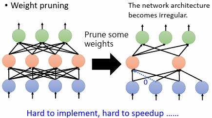
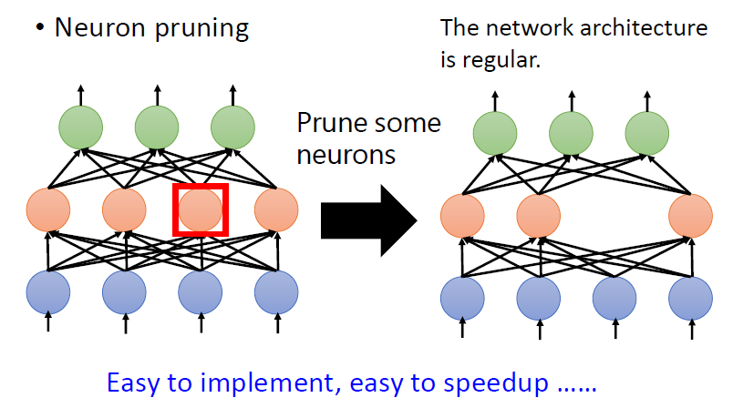
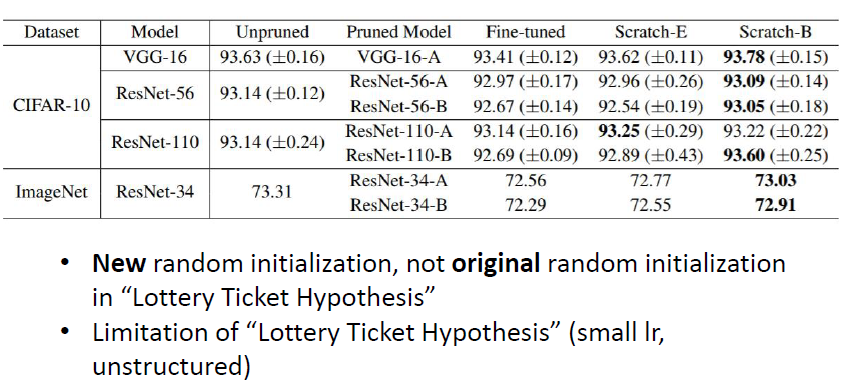
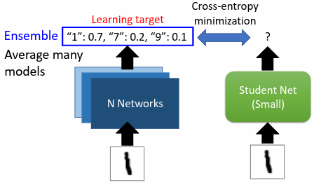
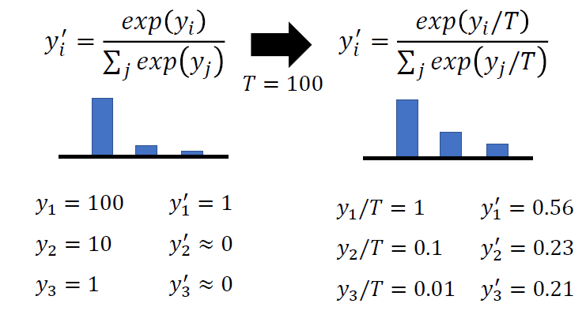
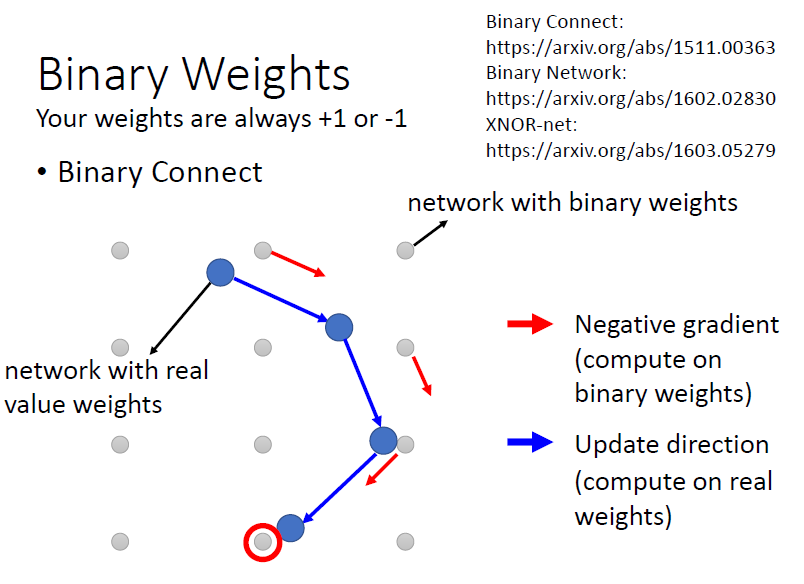
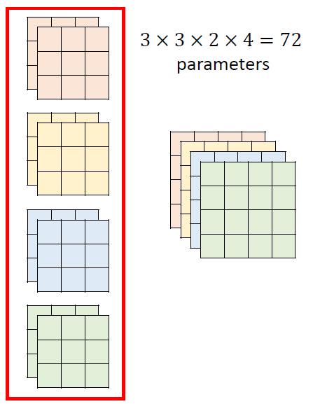
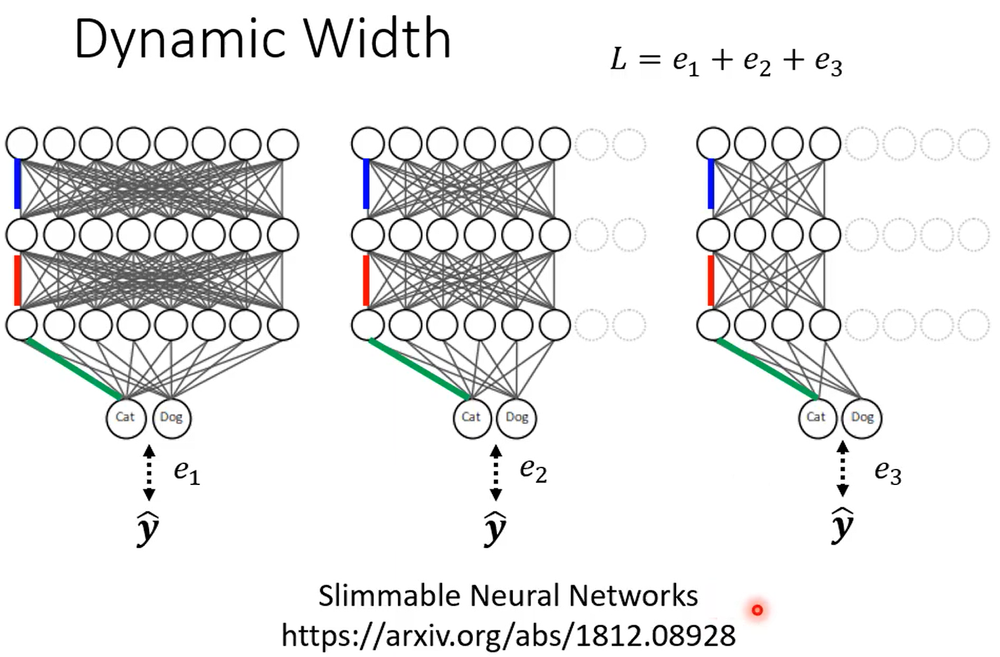

# Network Compression

# 1. Introduction

把模型用在资源有限的环境下，拥有比较少量的参数，但是与原模型有差不多的效果

‍

五个network compression 技术（软体导向）：

1. Network Pruning
2. Knowledge Distillation
3. Parameter Quantization
4. Architecture Design
5. Dynamic Computation

**五种技术的前四种不互斥，可以同时使用**

# 2. Network Pruning

network 中有许多参数，有可能有些参数没有用处，只是占空间、浪费运算资源而已，而**network pruning 就是把network 中没有用的参数找出来删除掉**

1. 训练一个大的模型
2. **评估weight 或neuron 的重要性**

   - **weight**的重要性

     - 参数加上绝对值得大小
     - 套用LLL的思想，计算bi
   - **neuron**的重要性

     - 计算神经元输出不为0的次数
3. 移除不重要的**weight**或​**neuron**（此时模型性能可能下降）
4. 微调模型
5. 重复步骤2. 至4.

### 2.1 Weight pruning

**问题：**

删除weight 后，神经网路形状不规则，实作上难以实现，也难以使用GPU 加速矩阵乘法

### 2.2 Neuron pruning

容易实现，且容易加速运算

## 2.3 Why Pruning？

**问题：**

先训练大的network 再把它变小，且希望小的network 跟大的network 正确率没有差太多，那么为什么不直接训练小的network

**原因：**

因为大的network 比较好训练，可参照过去录像：[https://youtu.be/_VuWvQUMQVk](https://youtu.be/_VuWvQUMQVk)

### 2.3.1 Lottery Ticket Hypothesis

[Lottery Ticket Hypothesis](https://arxiv.org/abs/1803.03635)解释为什么大的network 比较容易训练（注意是”假说”）

​**大的network 可以视为是很多小的sub-network 的组合**，当训练大的network 时，等于是在训练很多小的network

对于每个sub-network 不一定可以训练成功，不一定可以透过gradient descent 找到好的解使loss 变低。但只要有**大量的sub-network，其中一个成功，大的network 就成功了**

**实验证明：**

将一参数是随机初始化的大network 训练后进行pruning 的到一个pruned network

针对此pruned network 分别采取两个行为：

- ​**参数随机初始化进行训练**​，实验结果发现**难以训练成功**
- ​**参数使用pruning 前且训练前network**​，实验结果发现**可以训练成功**

**解构Lottery Ticket Hypothesis：**

**结论：**

- 找到了两种最为有效的pruning strategy
- **正负号**是network 能不能被训练起来的关键，绝对值事实上相对不重要
- 随机初始化network，就已经可以对一些参数进行剪枝，并得到一个效果不错的network

### 2.3.2 反对大乐透假说：Rethinking the Value of Network Pruning

- 对于pruned 后的network，作完全随机的初始化，并经过更多epoch 的训练，也更得到比pruned 后的network 甚至pruned 前的network 更好的性能
- 大乐透假说可能只在某些条件下才观察得到

  - 小的learning rate
  - 不规则的network （删除weight）

# 3. Knowledge Distillation

对于同一个任务，训练两个network：

- **Teacher Network：** 大的network，也可以是多个模型的ensemble
- **Student Network：** 小的network，是真正想要训练的network

以手写辨识为例，teacher network 输出数字的机率分布，student network 的输出也要是数字的机率分布，**期望与teacher network 的结果越接近越好**

## 3.1 Temperature for softmax

输出是经过softmax 运算的结果，使每一个数字变为机率分布介于0 和1 之间

**问题：**

使用原始的softmax 可能会有机率分布集中的问题，这样与直接给予正确答案没有什么不同，对于student network来说没有帮助，因为teacher network没有提供额外的讯息

**解决：**

**新增超参数temperature** T，使输出的机率分布变得比较平滑

# 4. Parameter Quantization

### 4.1 减少bits 数

使用较少的空间（bits）储存一个参数。一般在存一个参数可能是用64 bits，但可能不必用这么高的精度，可能用16 bits、8 bits 或更少就足够了

### 4.2 Weight clustering

依参数数值接近程度​**将参数分群**​，让​**同一群的参数有一样的数值（取同群参数的平均）** ​，并**建立一个table 记录每一群的值**

### 4.3 Huffman encoding

较常出现的使用较少bits；较少出现的使用较多bits

### 4.4 Binary weight

只以正负1 表示所有参数

# 5. Architecture Design

## 5.1 Low rank approximation

输入有N 个neuron，输出有M 个neuron，两层之间的参数量W = N x M ，只要N 跟M 其中一者很大，W 的参数量就会很大

为了减少参数量，可在N 跟M 中间新增一层layer，这一层的neuron 数目是 K

​**原参数量是M x N**​；而新增一neuron 数为K 的layer 后，​**参数量减少为K x（N + M）** ，若K 远小于M 跟N，那么U 跟V 的参数量加起来，会比W 还少的多

**问题：**

W 分成用U 跟V 两层来分开表示时，会减少W 的可能性，W 的rank 会≤ K

## 5.2 Depthwise Separable Convolution

### 5.2.1 Depthwise Convolution

考虑一个channel 的内部关系

- 每个filter 负责一个channel
- channel 数目和filter 数目相同
- input channel 和output channel 数目相同
- channels 之间没有互动

### 5.2.2 Pointwise Convolution

考虑channels 之间的关系

做完depthwise convolution 后，进行pointwise convolution

- filter size 限制为1×11×1
- 输入channel 和输出channel 的数目可以不同

**二者关系：**

观察右侧红色左上角框内数据的来源，都是来自左侧原图中左上3×3×23×3×2的区域，只是在depthwise separable convolution中，将原来的一次卷积的操作改为两次卷积，以此减少参数量

**参数量变化：**

																			

**实例：**

左侧为一般的卷积需要的参数量；右边是depthwise separable convolution 需要的参数量

计算可得，两者的参数量之比主要取决于$1/(K * K)$  

# 6. Dynamic Computation

希望network 可以根据实际运算资源情况，自动调整需要的运算量

## 6.1 Dynamic Depth

- **运算资源充足**时，可让图片​**跑过所有的layer**，得到最终的分类结果
- **运算资源不足**时，让network 决定要在哪一个layer 自行做输出

期望ground truth 跟每一个extra layer 的输出越接近越好，因此把所有的输出跟ground truth 的cross entropy 加总得到LL，目标最小化LL

## 6.2 Dynamic Width

在同一个network 中，设定好几个不同的宽度

将不同宽度的network 产生的每一个输出跟ground truth 的差距加总得到L，目标最小化L

## 6.3 network 自行决定深度和宽度

根据**输入资料的难易程度**，让network 自行决定执行的宽度和深度

